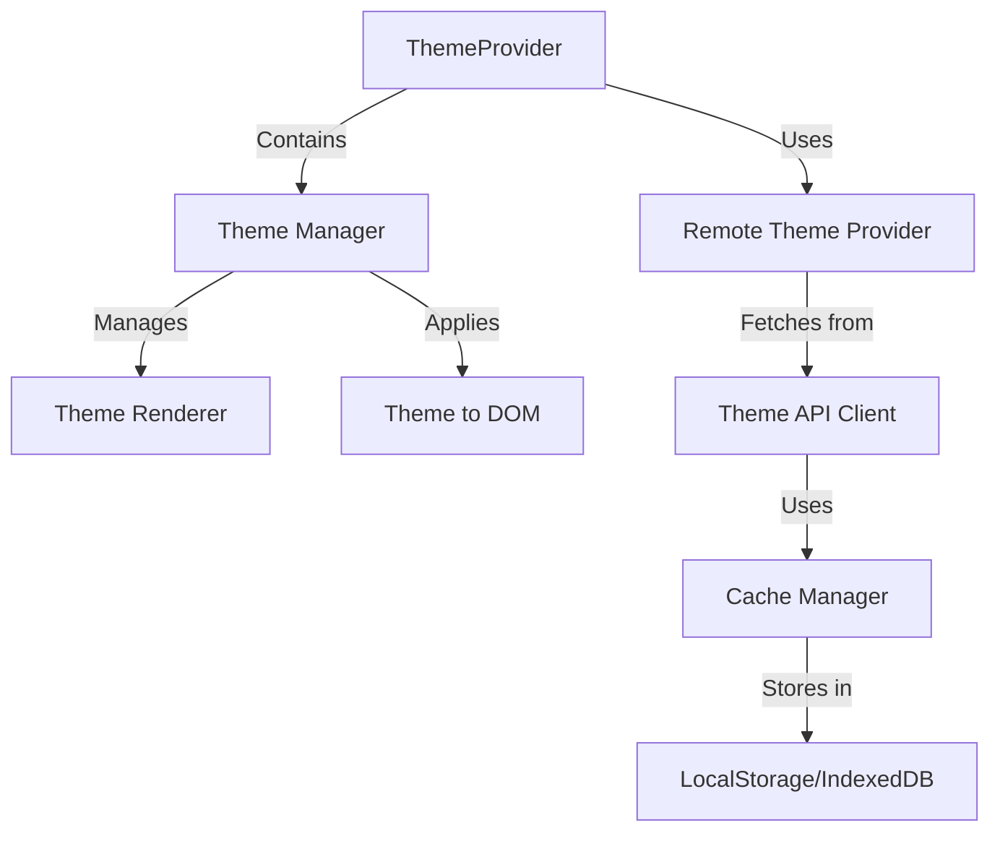

# ThemeSystem.com Technical Architecture Design

## System Architecture Overview

The ThemeSystem.com platform will be designed as a modern, cloud-native application with a focus on scalability, performance, and developer experience. This document outlines the technical architecture to support a theme marketplace with potentially 1000+ themes.

## Core Architecture Components


### 1. Frontend Components

#### 1.1 Theme Marketplace UI

- **Technology**: Next.js, React
- **Features**:
  - Theme browsing and search interface
  - Theme creator dashboards
  - User account management
  - Theme preview and testing
  - Purchase/download tracking

#### 1.2 Admin Dashboard

- **Technology**: Next.js, React
- **Features**:
  - Theme approval workflow
  - Analytics dashboards
  - User management
  - Content moderation
  - System configuration

#### 1.3 Theme Preview System

- **Technology**: React, Tailwind CSS
- **Features**:
  - Interactive theme previewer
  - Component showcase for each theme
  - Responsive testing
  - Dark/light mode toggle
  - Custom configuration testing

### 2. Backend Services

#### 2.1 API Gateway

- **Technology**: AWS API Gateway or Cloudflare Workers
- **Purpose**: Central entry point for all API requests, handling:
  - Authentication
  - Rate limiting
  - Request routing
  - Response caching
  - API versioning

#### 2.2 Theme Registry Service

- **Technology**: Node.js (TypeScript)
- **Features**:
  - Theme metadata CRUD operations
  - Search and discovery
  - Versioning
  - Analytics tracking
  - Theme validation

#### 2.3 Asset Service

- **Technology**: CDN-backed storage service
- **Features**:
  - Theme CSS serving
  - Preview image delivery
  - JS component serving (if applicable)
  - Version-controlled assets

#### 2.4 User Service

- **Technology**: Node.js (TypeScript)
- **Features**:
  - User authentication
  - Profile management
  - Permissions and roles
  - Usage tracking
  - API key management

#### 2.5 Analytics Service

- **Technology**: Node.js + time-series database
- **Features**:
  - Theme usage tracking
  - Performance metrics
  - Creator dashboards
  - Trending calculations
  - System health monitoring

### 3. Data Storage

#### 3.1 Metadata Database

- **Technology**: MongoDB or PostgreSQL
- **Stores**:
  - Theme metadata
  - User information
  - Ratings and reviews
  - Configuration settings
  - API keys and access tokens

#### 3.2 Asset Storage

- **Technology**: S3-compatible object storage
- **Stores**:
  - Theme CSS files
  - Preview images
  - Documentation
  - Component showcases

#### 3.3 Cache Layer

- **Technology**: Redis or Memcached
- **Purpose**:
  - API response caching
  - Theme metadata caching
  - Session management
  - Rate limiting counters

#### 3.4 Analytics Database

- **Technology**: ClickHouse or TimeScaleDB
- **Stores**:
  - Usage events
  - Performance metrics
  - Error logs
  - A/B test results

### 4. Infrastructure

#### 4.1 CDN Layer

- **Technology**: Cloudflare or CloudFront
- **Purpose**:
  - Global distribution of assets
  - Edge caching
  - DDoS protection
  - SSL termination

#### 4.2 Containerization

- **Technology**: Docker + Kubernetes
- **Purpose**:
  - Service isolation
  - Scaling
  - Deployment automation
  - Resource management

#### 4.3 CI/CD Pipeline

- **Technology**: GitHub Actions or GitLab CI
- **Features**:
  - Automated testing
  - Theme validation
  - Deployment automation
  - Versioning

## Client-Side SDK Architecture

### 1. Core SDK Components



### 2. SDK Module Structure

```
@acme/theme-system/
├── src/
│   ├── core/
│   │   ├── ThemeProvider.tsx      # Main provider component
│   │   ├── ThemeManager.ts        # Theme state management
│   │   ├── ThemeRenderer.ts       # DOM manipulation for theme application
│   │   └── types.ts               # Core type definitions
│   ├── remote/
│   │   ├── RemoteThemeProvider.ts # Remote theme functionality
│   │   ├── ThemeApiClient.ts      # API integration
│   │   ├── CacheManager.ts        # Caching strategies
│   │   └── types.ts               # Remote-specific types
│   ├── ui/
│   │   ├── ThemeSelector.tsx      # Pre-built theme selector
│   │   ├── ThemePreview.tsx       # Theme preview component
│   │   └── index.ts               # UI component exports
│   ├── utils/
│   │   ├── cssLoader.ts           # Dynamic CSS loading
│   │   ├── storage.ts             # Browser storage utilities
│   │   └── fallbacks.ts           # Fallback mechanisms for offline use
│   └── index.ts                   # Main package entry
└── package.json
```

### 3. Key Classes and Interfaces

```typescript
// Core theme definition
interface ThemeDefinition {
  id: string;
  name: string;
  description: string;
  version: string;
  author: string;
  preview: string | ThemePreviewConfig;
  stylesheet: string | ThemeStylesheetConfig;
  variables: Record<string, string>;
  tags: string[];
  isRemote?: boolean;
  lastUpdated?: string;
}

// Remote theme configuration
interface RemoteThemeConfig {
  enabled: boolean;
  apiKey?: string;
  endpoint?: string;
  categories?: string[];
  cacheStrategy?: "memory" | "localStorage" | "indexedDB";
  offlineMode?: "strict" | "fallback";
  preload?: string[] | boolean;
  refreshInterval?: number;
}

// Theme manager
class ThemeManager {
  private themes: Map<string, ThemeDefinition>;
  private currentThemeId: string;
  private renderer: ThemeRenderer;
  private remoteProvider?: RemoteThemeProvider;

  constructor(config: ThemeManagerConfig) {
    // Initialize with local themes and remote provider if enabled
  }

  // Get currently active theme
  getCurrentTheme(): ThemeDefinition {
    // Return current theme
  }

  // Set active theme (local or remote)
  async setTheme(themeId: string): Promise<boolean> {
    // Check if theme is available locally
    // If not, try to fetch from remote if enabled
    // Apply theme using renderer
  }

  // Get all available themes (local + remote)
  async getAvailableThemes(): Promise<ThemeDefinition[]> {
    // Combine local and remote themes
  }
}

// Remote theme provider
class RemoteThemeProvider {
  private apiClient: ThemeApiClient;
  private cache: CacheManager;

  constructor(config: RemoteThemeConfig) {
    // Initialize API client and cache
  }

  // Get available remote themes
  async getRemoteThemes(): Promise<ThemeDefinition[]> {
    // Check cache first, then API
  }

  // Get specific remote theme
  async getTheme(themeId: string): Promise<ThemeDefinition | null> {
    // Check cache first, then API
  }

  // Preload themes
  async preloadThemes(themeIds: string[]): Promise<void> {
    // Fetch and cache multiple themes
  }
}
```

## API Architecture

### 1. Theme API Endpoints

#### 1.1 Theme Discovery

```
GET /api/v1/themes
```

**Parameters:**

- `page`: Page number for pagination
- `limit`: Number of themes per page
- `search`: Search term
- `tags`: Filter by tags
- `sort`: Sort by (popular, recent, name)

**Response:**

```json
{
  "themes": [
    {
      "id": "glass-theme",
      "name": "Glass Theme",
      "description": "Clean, minimal interface with subtle transparency effects",
      "preview": "https://api.themesystem.com/previews/glass-theme.png",
      "author": "ACME Design",
      "version": "1.2.0",
      "downloads": 23456,
      "rating": 4.8,
      "tags": ["minimal", "modern", "transparent"]
    }
    // More themes...
  ],
  "pagination": {
    "total": 1245,
    "page": 1,
    "limit": 20,
    "pages": 63
  }
}
```

#### 1.2 Theme Retrieval

```
GET /api/v1/themes/:themeId
```

**Response:**

```json
{
  "id": "glass-theme",
  "name": "Glass Theme",
  "description": "Clean, minimal interface with subtle transparency effects",
  "preview": "https://api.themesystem.com/previews/glass-theme.png",
  "stylesheet": "https://api.themesystem.com/css/glass-theme.css",
  "variables": {
    "--glass-background": "rgba(255, 255, 255, 0.8)",
    "--glass-blur": "8px"
    // More variables...
  },
  "author": "ACME Design",
  "authorUrl": "https://example.com",
  "version": "1.2.0",
  "lastUpdated": "2023-05-15T20:15:30Z",
  "downloads": 23456,
  "rating": 4.8,
  "tags": ["minimal", "modern", "transparent"]
}
```

#### 1.3 Theme Assets

```
GET /assets/css/:themeId.css
GET /assets/previews/:themeId.png
```

### 2. User API Endpoints

```
POST /api/v1/auth/login
POST /api/v1/auth/register
GET /api/v1/users/me
GET /api/v1/users/me/themes
```

### 3. Creator API Endpoints

```
POST /api/v1/themes
PUT /api/v1/themes/:themeId
GET /api/v1/analytics/themes/:themeId
```

## Performance Optimizations

### 1. Theme Delivery Optimization

#### 1.1 CSS Optimization

- Minification of CSS
- Critical CSS extraction
- CSS variables optimization
- Removal of unused CSS

#### 1.2 Asset Delivery

- HTTP/2 for parallel loading
- Brotli compression
- CDN distribution
- Cache-Control headers

#### 1.3 Prefetching

- DNS prefetching for API and CDN domains
- Preconnect hints in SDK
- Optional theme preloading

### 2. Caching Strategy

#### 2.1 Browser Caching

- LocalStorage for theme metadata
- IndexedDB for theme assets
- Service Worker for offline support

#### 2.2 API Caching

- Redis layer for hot themes
- CDN caching for assets
- Stale-while-revalidate approach

#### 2.3 Cache Invalidation

- Version-based invalidation
- Theme-specific ETags
- Selective invalidation on updates

### 3. Lazy Loading

```typescript
// Example of lazy theme loading implementation
class LazyThemeLoader {
  private loadedThemes: Set<string> = new Set();

  async ensureThemeLoaded(themeId: string): Promise<void> {
    if (this.loadedThemes.has(themeId)) return;

    // Fetch CSS only when needed
    const cssUrl = `https://api.themesystem.com/css/${themeId}.css`;
    await this.loadCSS(cssUrl);

    this.loadedThemes.add(themeId);
  }

  private async loadCSS(url: string): Promise<void> {
    return new Promise((resolve, reject) => {
      const link = document.createElement("link");
      link.rel = "stylesheet";
      link.href = url;
      link.onload = () => resolve();
      link.onerror = () => reject(new Error(`Failed to load CSS: ${url}`));
      document.head.appendChild(link);
    });
  }
}
```

## Security Considerations

### 1. CSS Security

#### 1.1 CSS Injection Prevention

- Sanitization of CSS files
- CSP configuration recommendations
- Isolation of theme CSS via Shadow DOM (optional)

#### 1.2 Theme Validation

- Automated scanning for unsafe patterns
- Content-Security-Policy enforcement
- Validation against malicious CSS

### 2. API Security

#### 2.1 Authentication

- JWT-based authentication
- API key validation
- CORS policy enforcement

#### 2.2 Rate Limiting

- Per-user rate limiting
- Graduated rate limits based on plan
- Caching headers to reduce requests

### 3. Data Protection

#### 3.1 Theme Integrity

- Digital signatures for themes
- Version integrity checking
- Immutable theme assets

#### 3.2 User Data

- Minimal data collection
- Transparent usage tracking
- Opt-out mechanisms

## Offline Support

### 1. Service Worker Integration

```typescript
// In the SDK
async function registerServiceWorker(): Promise<void> {
  if ("serviceWorker" in navigator) {
    try {
      const registration = await navigator.serviceWorker.register(
        "/theme-system-sw.js",
      );
      console.log("ThemeSystem SW registered:", registration);
    } catch (error) {
      console.error("ThemeSystem SW registration failed:", error);
    }
  }
}
```

### 2. Offline Fallback Strategy

```typescript
// In the theme manager
async setTheme(themeId: string): Promise<boolean> {
  try {
    // Try to get theme from cache or API
    const theme = await this.getTheme(themeId);

    if (theme) {
      // Apply theme
      this.renderer.applyTheme(theme);
      return true;
    }

    // If theme not available and we're offline
    if (!navigator.onLine && this.config.offlineMode !== 'strict') {
      // Apply fallback theme
      this.renderer.applyTheme(this.getDefaultTheme());
      return true;
    }

    return false;
  } catch (error) {
    // Apply default theme on error if fallback mode
    if (this.config.offlineMode !== 'strict') {
      this.renderer.applyTheme(this.getDefaultTheme());
      return true;
    }
    throw error;
  }
}
```

## Scalability Design

### 1. API Scalability

#### 1.1 Multi-region Deployment

- Global CDN distribution
- Regional API endpoints
- Geo-aware DNS routing

#### 1.2 Microservices Architecture

- Independent scaling of services
- Dedicated theme asset service
- Separate metadata and content services

### 2. Database Scalability

#### 2.1 Sharding Strategy

- Theme-based sharding
- Read replicas for popular themes
- Cache-heavy architecture

#### 2.2 Database Growth Planning

- Time-series data partitioning
- Cold storage for historical data
- Metadata vs. asset separation

## Monitoring and Observability

### 1. Metrics Collection

#### 1.1 SDK Metrics

- Theme load timing
- Switch timing
- Error rates
- Cache hit/miss ratio

#### 1.2 API Metrics

- Request volume
- Response time
- Error rates
- Cache effectiveness

### 2. Logging Strategy

```typescript
// In the SDK
enum LogLevel {
  ERROR = 0,
  WARN = 1,
  INFO = 2,
  DEBUG = 3,
}

class Logger {
  private level: LogLevel;
  private context: string;

  constructor(context: string, level: LogLevel = LogLevel.INFO) {
    this.context = context;
    this.level = level;
  }

  error(message: string, data?: any): void {
    if (this.level >= LogLevel.ERROR) {
      console.error(`[ThemeSystem:${this.context}] ${message}`, data);
      // Optionally send to error tracking service
    }
  }

  // Other methods: warn, info, debug
}
```

## Implementation Roadmap

### Phase 1: Foundation (Months 0-3)

1. **Core SDK Development**

   - Basic theme application
   - Local theme support
   - Remote theme capabilities
   - Caching system

2. **API Development**

   - Theme discovery endpoints
   - Theme retrieval endpoints
   - Asset delivery system
   - Basic authentication

3. **Theme Repository**
   - Basic theme upload system
   - Automated validation pipeline
   - Initial theme marketplace UI
   - Preview generation system

### Phase 2: Scaling and Features (Months 4-9)

1. **Advanced SDK Features**

   - Offline support
   - Performance optimizations
   - Progressive enhancement
   - Advanced theme switcher components

2. **Platform Enhancements**

   - Search and discovery improvements
   - Rating and review system
   - Advanced analytics
   - Creator dashboards

3. **Infrastructure Scaling**
   - CDN integration
   - Distributed caching
   - Database scaling strategy
   - Multi-region deployment

### Phase 3: Ecosystem (Months 10-18)

1. **Monetization Features**

   - Paid themes support
   - Subscription billing
   - Revenue sharing system
   - Enterprise features

2. **Integration Ecosystem**

   - Framework-specific adapters
   - Build tool plugins
   - CLI tools
   - Visual theme editor

3. **Advanced Platform Features**
   - Theme combination system
   - AI-powered recommendations
   - Advanced analytics
   - Community features

## Conclusion

The ThemeSystem.com platform architecture is designed to support a large-scale theme marketplace while maintaining performance, reliability, and a developer-friendly experience. By implementing a robust client SDK, efficient API design, and scalable infrastructure, the platform can handle thousands of themes while providing an excellent user experience.

Key success factors include:

1. Performance-focused design with aggressive caching
2. Progressive enhancement for resilience
3. Comprehensive monitoring and alerting
4. Phased implementation approach

This architecture provides a solid foundation for building a thriving theme ecosystem while ensuring the platform can scale to meet future demand.
