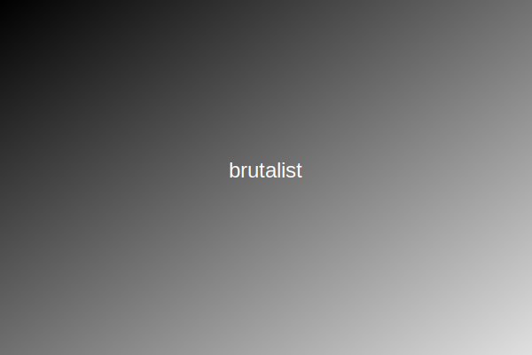

# Brutalist Theme for ACME Theme System

Bold, raw design with high contrast, sharp edges, and minimal decoration.



## Installation

```bash
pnpm add @acme/theme-brutalist
```

## Usage

### Import the CSS

```tsx
// In your main layout or global styles file
import "@acme/theme-brutalist/dist/css/brutalist.css";
```

### Apply the theme using ThemeProvider

```tsx
import brutalistTheme from "@acme/theme-brutalist";
import { ThemeProvider } from "@acme/theme-system";

function App({ children }) {
  return (
    <ThemeProvider
      themes={[brutalistTheme]}
      config={{ defaultTheme: "brutalist" }}
    >
      {children}
    </ThemeProvider>
  );
}
```

### Toggle themes

```tsx
import { ThemeSelector, useTheme } from "@acme/theme-system";

function ThemeToggle() {
  const { themes, currentTheme, setTheme } = useTheme();

  return (
    <ThemeSelector
      themes={themes}
      currentTheme={currentTheme}
      onSelect={setTheme}
    />
  );
}
```

## Features

- High contrast design with strong visual hierarchy
- Sharp edges and geometric forms
- Bold typography with monospace accents
- Minimal decoration and ornamentation
- Raw, functional aesthetic

## Customization

You can customize the theme by overriding CSS variables:

```css
:root {
  --brutalist-primary: #000000;
  --brutalist-card-border: 2px solid #000;
}
```

## License

MIT
