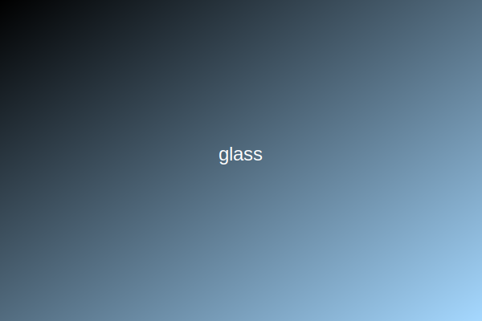

# Glass Theme for ACME Theme System

A clean, minimal interface with subtle transparency effects and soft shadows.



## Installation

```bash
pnpm add @acme/theme-glass
```

## Usage

### Import the CSS

```tsx
// In your main layout or global styles file
import "@acme/theme-glass/dist/css/glass.css";
```

### Apply the theme using ThemeProvider

```tsx
import glassTheme from "@acme/theme-glass";
import { ThemeProvider } from "@acme/theme-system";

function App({ children }) {
  return (
    <ThemeProvider themes={[glassTheme]} config={{ defaultTheme: "glass" }}>
      {children}
    </ThemeProvider>
  );
}
```

### Toggle themes

```tsx
import { ThemeSelector, useTheme } from "@acme/theme-system";

function ThemeToggle() {
  const { themes, currentTheme, setTheme } = useTheme();

  return (
    <ThemeSelector
      themes={themes}
      currentTheme={currentTheme}
      onSelect={setTheme}
    />
  );
}
```

## Features

- Subtle transparency and backdrop blur effects
- Soft shadows and rounded corners
- Light color palette with cool blue accents
- Smooth transitions between states
- Consistent spacing and typography

## Customization

You can customize the theme by overriding CSS variables:

```css
:root {
  --glass-primary: #3b82f6;
  --glass-card-bg: hsla(0, 0%, 100%, 0.7);
}
```

## License

MIT
