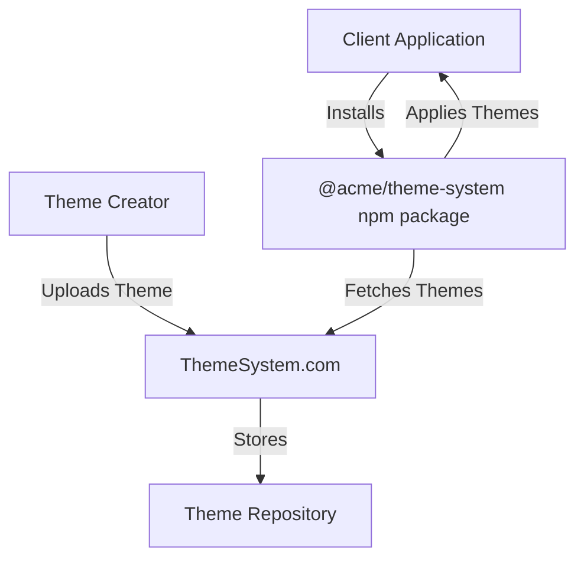

# ThemeSystem.com Platform Analysis

## Overview

This document explores the architecture, benefits, challenges, and recommendations for creating a centralized ThemeSystem.com platform that would:

1. Allow users to upload and publish theme plugins
2. Serve these themes through an API to client applications
3. Eliminate the need for users to install individual theme packages
4. Support a potential ecosystem of 1000+ themes

## Architectural Considerations

### Core Architecture



### Key Components

1. **Theme Registry Platform**

   - Web interface for uploading, managing, and discovering themes
   - Version control and publishing workflow
   - Theme validation and testing
   - Analytics and usage statistics
   - User accounts and permissions

2. **Theme API Service**

   - Endpoints for discovering available themes
   - Fetching theme assets (CSS, previews, metadata)
   - Versioning and caching
   - Authentication and rate limiting

3. **Client SDK (npm package)**
   - Theme fetching and caching
   - Theme application
   - Offline support
   - TypeScript types and intellisense for available themes

## Benefits

### For End Users (Application Developers)

- **Simplified Installation**: Single package installation instead of multiple themes
- **Dynamic Theme Discovery**: Access to all themes without updating dependencies
- **Reduced Bundle Size**: Only download themes that are actually used
- **Automatic Updates**: Get theme updates without changing package versions
- **Consistency**: Guaranteed compatibility between themes and the core system

### For Theme Creators

- **Centralized Distribution**: One place to publish and update themes
- **Analytics**: See how many applications use their themes
- **Discoverability**: Easier for users to find their themes
- **Standardization**: Clear guidelines and validation for theme creation
- **Community**: Build reputation and get feedback

### For Platform Owner

- **Ecosystem Control**: Central point of governance for the theme ecosystem
- **Monetization Options**: Premium themes, subscriptions, or sponsored listings
- **Data Insights**: Understand theme usage patterns across applications
- **Network Effects**: More themes attract more users which attract more theme creators

## Challenges and Considerations

### Technical Challenges

1. **Performance**

   - **CDN Integration**: Essential for global distribution of theme assets
   - **Caching Strategy**: Optimized caching at multiple levels (CDN, browser, SDK)
   - **Bundle Size Management**: Strategies for lazy-loading themes
   - **API Scalability**: Handling thousands of concurrent requests

2. **Reliability**

   - **High Availability**: Ensuring the platform is always accessible
   - **Offline Support**: Applications must work when offline
   - **Fallback Mechanisms**: Default themes when network is unavailable
   - **Version Consistency**: Managing theme versioning and conflicts

3. **Security**
   - **CSS Injection**: Preventing malicious CSS
   - **Authentication**: Secure API access
   - **Theme Validation**: Ensuring themes meet security standards
   - **Rate Limiting**: Preventing abuse

### Business Challenges

1. **Monetization Strategy**

   - Free vs. premium themes model
   - Subscription for platform access
   - Theme marketplace with revenue sharing
   - Enterprise licensing

2. **Governance**

   - Theme approval process
   - Quality standards enforcement
   - Dispute resolution
   - Copyright and intellectual property management

3. **Marketing and Adoption**
   - Building initial theme library
   - Developer evangelism
   - Documentation and examples
   - Integration with popular frameworks

## Implementation Approach

### Core SDK Changes

The npm package would need significant changes to support this model:

```typescript
// New ThemeProvider with remote theme support
interface ThemeProviderProps {
  // Allow explicit themes and/or remote themes
  themes?: ThemeDefinition[];

  // Remote themes configuration
  remote?: {
    enabled: boolean;
    apiKey?: string;
    endpoint?: string;
    categories?: string[];
    cacheStrategy?: "memory" | "localStorage" | "indexedDB";
    offlineMode?: "strict" | "fallback";
    preload?: string[] | boolean;
  };

  // Other props...
  children: React.ReactNode;
}
```

### Theme Fetching and Caching

```typescript
// Theme fetching service
class ThemeService {
  private cache: Map<string, ThemeDefinition> = new Map();
  private endpoint: string;

  constructor(config: RemoteConfig) {
    this.endpoint = config.endpoint || "https://api.themesystem.com/v1";
  }

  // Fetch available themes
  async getAvailableThemes(): Promise<ThemeSummary[]> {
    // Fetch from API with caching
  }

  // Get a specific theme with full definition
  async getTheme(id: string): Promise<ThemeDefinition> {
    // Check cache first
    if (this.cache.has(id)) {
      return this.cache.get(id)!;
    }

    // Fetch from API
    const theme = await this.fetchTheme(id);

    // Cache the result
    this.cache.set(id, theme);

    return theme;
  }

  // Preload multiple themes
  async preloadThemes(ids: string[]): Promise<void> {
    // Fetch multiple themes in parallel
  }
}
```

### Client-Side Integration

```tsx
// In user's application
import { ThemeProvider } from "@acme/theme-system";

function MyApp({ Component, pageProps }) {
  return (
    <ThemeProvider
      remote={{
        enabled: true,
        apiKey: "user_api_key",
        preload: ["popular-theme-1", "popular-theme-2"],
        cacheStrategy: "localStorage",
      }}
    >
      <Component {...pageProps} />
    </ThemeProvider>
  );
}
```

### Theme Selection Component

```tsx
// Enhanced theme selector with remote themes
import { useTheme } from "@acme/theme-system";

function ThemeSelector() {
  const { availableThemes, currentTheme, setTheme, isLoading } = useTheme();

  if (isLoading) {
    return <div>Loading themes...</div>;
  }

  return (
    <div className="theme-selector">
      {availableThemes.map((theme) => (
        <button
          key={theme.id}
          className={theme.id === currentTheme.id ? "active" : ""}
          onClick={() => setTheme(theme.id)}
        >
          
          <span>{theme.name}</span>
        </button>
      ))}
    </div>
  );
}
```

## Scaling to 1000+ Themes

### Challenges with Scale

1. **Discovery Problem**

   - Users cannot browse 1000+ themes effectively
   - Search and filtering become critical
   - Categorization and tagging system needed

2. **Performance Concerns**

   - API response size for listing all themes
   - Preview image loading for large theme sets
   - CSS file size when many themes are used

3. **Quality Control**
   - Maintaining quality standards across many themes
   - Duplicate/similar themes creating noise
   - Outdated themes that no longer meet current standards

### Solutions for Scale

1. **Theme Marketplace Features**

   - Advanced search with filters (colors, style, purpose)
   - Rating and review system
   - Popularity and trending metrics
   - Categories and tags (minimalist, corporate, playful, etc.)
   - Featured and curated collections

2. **Technical Optimizations**

   - Pagination for theme listings
   - GraphQL API for precise data fetching
   - Theme metadata API separate from full theme assets
   - Dynamic loading of theme assets
   - Compressed CSS delivery

3. **Quality Management**
   - Automated theme validation tools
   - Community curation and flagging
   - Theme analytics for identifying unused themes
   - Deprecation policy for outdated themes
   - Theme creator reputation system

## Privacy and Data Considerations

1. **Usage Tracking**

   - What data is collected about theme usage
   - How this data is shared with theme creators
   - Opt-out options for sensitive applications

2. **GDPR and Compliance**

   - Data processing agreements
   - Data storage locations
   - User control over data

3. **Enterprise Concerns**
   - Private themes for enterprise users
   - On-premise deployment options
   - Air-gapped environments support

## Recommendation

### Phased Approach

1. **Phase 1: Foundation (Months 0-3)**

   - Build basic platform with theme upload/download
   - Create core SDK with remote theme support
   - Implement caching and offline support
   - Launch with 10-20 high-quality themes

2. **Phase 2: Scale (Months 4-9)**

   - Add search, filtering, and discovery features
   - Implement theme validation and quality tools
   - Expand theme metadata for better categorization
   - Build theme creator dashboards and analytics

3. **Phase 3: Ecosystem (Months 10-18)**
   - Launch marketplace with monetization options
   - Add customization tools for themes
   - Implement theme collections and combinations
   - Build integration plugins for popular frameworks

### Development Priorities

1. **User Experience First**

   - Ensure the developer experience remains simple despite the platform's complexity
   - Focus on performance and reliability
   - Make theme switching instant and seamless

2. **Progressive Enhancement**

   - Basic functionality works without network access
   - Remote themes enhance the experience but aren't required
   - Support for both bundled and remote themes

3. **API Design**
   - Well-documented, versioned API
   - Clear separation between theme metadata and assets
   - Comprehensive error handling and fallbacks

## Conclusion

A centralized ThemeSystem.com platform offers significant advantages for creating a vibrant theme ecosystem. It simplifies the end-user experience, provides better distribution for theme creators, and enables the system to scale to thousands of themes.

However, this approach introduces new technical challenges around performance, reliability, and security. It also changes the business model from a pure open-source library to a platform/service hybrid.

With thoughtful implementation focused on performance, offline support, and user experience, this platform could become a compelling offering that differentiates from traditional CSS frameworks and theme systems.

The recommended approach is to start with a solid foundation focusing on the core experience, then gradually build out the marketplace and ecosystem features as adoption grows.
