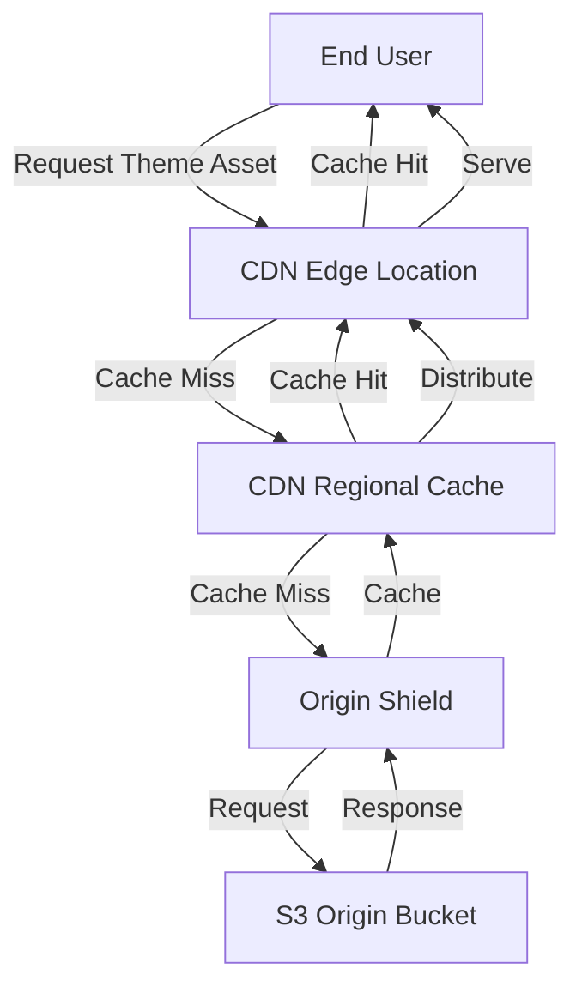

# CDN Layer Deep Dive

## Overview

The Content Delivery Network (CDN) layer is a critical component of the ThemeSystem platform, responsible for the global distribution of theme assets. This document provides a comprehensive overview of the CDN architecture, its integration with the rest of the platform, and best practices for implementation.

## Role in the Architecture

The CDN layer serves several crucial functions in the ThemeSystem architecture:

1. **Global Distribution**: Delivers theme assets (CSS, images, documentation) from edge locations close to end users
2. **Performance Optimization**: Reduces latency for theme application and switching
3. **Traffic Management**: Handles high-volume requests without overwhelming origin servers
4. **Security Enhancement**: Provides DDoS protection and traffic filtering
5. **Cost Reduction**: Minimizes bandwidth costs from origin servers

## CDN Architecture

The ThemeSystem CDN implementation is designed as a multi-tier distribution system:



### Key Components

1. **Edge Locations**:

   - Globally distributed points of presence (PoPs)
   - First point of contact for user requests
   - Serve cached content with minimal latency

2. **Regional Caches**:

   - Second-tier caching layer
   - Reduce load on origin shield
   - Optimize for regional access patterns

3. **Origin Shield**:

   - Protective layer in front of origin servers
   - Aggregation point for cache misses
   - Reduces origin server load

4. **Origin Server**:
   - S3 buckets storing authoritative theme assets
   - Only accessed when content is not in any cache layer
   - Protected from direct user access

## CDN Provider Options

The ThemeSystem architecture supports multiple CDN providers, each with specific advantages:

### Cloudflare

**Advantages**:

- Extensive global network
- Advanced security features (WAF, Bot Protection)
- Workers platform for edge computing
- Affordable pricing model

**Implementation Details**:

- Origin configuration pointing to S3 bucket
- Cache rules based on asset types
- Workers for dynamic URL transformation
- Custom cache keys for theme versioning

### AWS CloudFront

**Advantages**:

- Tight integration with S3 and Lambda@Edge
- Predictable pricing for high-volume traffic
- Field-level encryption options
- Origin failover capabilities

**Implementation Details**:

- Origin Access Identity for S3 security
- Cache behaviors for different theme asset types
- Lambda@Edge for request/response manipulation
- Regional edge caches for improved performance

### Multi-CDN Strategy

For maximum reliability and performance, ThemeSystem can implement a multi-CDN strategy:

- Primary CDN handles regular traffic
- Secondary CDN provides failover
- DNS-based traffic steering for optimal routing
- Performance-based CDN selection

## Cache Strategy

### Cache Rules by Content Type

| Content Type   | Cache TTL | Cache Control                                      | Invalidation Frequency |
| -------------- | --------- | -------------------------------------------------- | ---------------------- |
| Theme CSS      | 7 days    | public, max-age=604800                             | On theme update        |
| Preview Images | 30 days   | public, max-age=2592000                            | On image update        |
| Metadata JSON  | 1 hour    | public, max-age=3600, stale-while-revalidate=86400 | On metadata change     |
| Documentation  | 1 day     | public, max-age=86400                              | On doc update          |

### Cache Key Strategy

The CDN cache key structure is designed to optimize hit rates while ensuring version accuracy:

```
/{theme-id}/{version}/{asset-type}/{file-name}
```

For example:

- `/glass-theme/v1.2.0/css/glass-theme.min.css`
- `/brutalist-theme/latest/preview/thumbnail.png`

### Cache Invalidation Strategies

1. **Versioned URLs**: Primary strategy - new versions get new URLs
2. **Selective Invalidation**: For urgent updates to existing assets
3. **Wildcard Invalidation**: For theme-wide changes (e.g., `/glass-theme/*`)
4. **Scheduled Purges**: Low-priority assets refreshed during off-peak hours

## Performance Optimizations

### 1. File Optimization

- **CSS Minification**: Reduces file size before distribution
- **Gzip/Brotli Compression**: Further reduces transfer size
- **Image Optimization**: WebP format with fallbacks
- **HTTP/2 or HTTP/3**: Reduces connection overhead

### 2. Cache Warming

- Proactive cache population after theme updates
- Scheduled warming for popular themes
- Regional distribution prioritization based on usage patterns

### 3. Request Collapsing

- Combine multiple identical requests during cache misses
- Reduce origin load during high-traffic events
- Implement request coalescing at the origin shield layer

### 4. Edge Computing

Using edge functions (Cloudflare Workers or Lambda@Edge) for:

- Dynamic theme transformations
- A/B testing of themes
- User-specific theme customizations
- Analytics capture without origin requests

## Security Implementation

### 1. HTTPS Enforcement

- TLS 1.3 for all connections
- HSTS implementation
- OCSP stapling
- Modern cipher suites only

### 2. Access Controls

- Signed URLs for premium themes
- Token authentication for restricted assets
- Geo-restriction capabilities for regional themes

### 3. DDoS Protection

- Rate limiting on theme API endpoints
- Bot detection and challenge systems
- Traffic anomaly detection
- Automatic mitigation responses

### 4. Content Security

- Strict CORS policy implementation
- Content-Security-Policy headers
- Subresource Integrity checks
- Malicious content scanning

## CDN Monitoring and Analytics

### 1. Performance Metrics

- **Cache Hit Ratio**: Target >95% for optimal performance
- **Time to First Byte (TTFB)**: <100ms target for cached assets
- **Origin Fetch Time**: Monitoring backend performance
- **Error Rates**: By region, theme, and asset type

### 2. Usage Analytics

- Popular themes tracking
- Regional usage patterns
- Traffic spikes and trends
- Device and browser statistics

### 3. Cost Metrics

- Bandwidth usage tracking
- Request volume by theme and asset type
- Origin data transfer costs
- Cache storage utilization

### 4. Alerting System

- Cache hit ratio drops
- Origin errors
- Latency spikes
- Security incidents
- Quota approaches

## Integration with Other Components

### 1. S3 Integration

- Origin path patterns for organized asset retrieval
- Custom origin headers for bucket routing
- Origin failover configuration
- Direct S3 event notification for cache invalidation

### 2. API Gateway Integration

- CDN as API Gateway cache
- API response caching rules
- Authentication passthrough
- Regional API routing

### 3. Analytics Service Integration

- Real-time CDN metrics forwarding
- Log shipping to analytics platform
- Custom header capture for tracking
- User behavior analysis

## Implementation Examples

### Cloudflare Worker for Theme Switching

```javascript
addEventListener("fetch", (event) => {
  event.respondWith(handleRequest(event.request));
});

async function handleRequest(request) {
  const url = new URL(request.url);

  // Handle theme asset requests
  if (url.pathname.startsWith("/assets/themes/")) {
    // Extract theme ID and version from URL
    const pathParts = url.pathname.split("/");
    const themeId = pathParts[3];
    const version = pathParts[4] || "latest";

    // Construct origin URL
    const originUrl = new URL(request.url);
    originUrl.hostname = "themes-storage.s3.amazonaws.com";

    // Add caching headers based on asset type
    const response = await fetch(originUrl, request);
    const modified = new Response(response.body, response);

    // Apply appropriate cache control based on asset type
    if (url.pathname.endsWith(".css")) {
      modified.headers.set("Cache-Control", "public, max-age=604800");
    } else if (url.pathname.match(/\.(png|jpg|webp)$/i)) {
      modified.headers.set("Cache-Control", "public, max-age=2592000");
    } else if (url.pathname.endsWith(".json")) {
      modified.headers.set(
        "Cache-Control",
        "public, max-age=3600, stale-while-revalidate=86400",
      );
    }

    return modified;
  }

  // Pass through other requests
  return fetch(request);
}
```

### CloudFront Cache Behavior Configuration

```yaml
CacheBehaviors:
  - PathPattern: /assets/themes/*/css/*
    TargetOriginId: theme-assets-s3
    ViewerProtocolPolicy: redirect-to-https
    Compress: true
    DefaultTTL: 604800 # 7 days
    MinTTL: 3600 # 1 hour
    MaxTTL: 31536000 # 1 year
    ForwardedValues:
      QueryString: false
      Cookies:
        Forward: none
    LambdaFunctionAssociations:
      - EventType: origin-request
        LambdaFunctionARN: !Ref ThemeProcessingFunction

  - PathPattern: /assets/themes/*/previews/*
    TargetOriginId: theme-assets-s3
    ViewerProtocolPolicy: redirect-to-https
    Compress: true
    DefaultTTL: 2592000 # 30 days
    MinTTL: 86400 # 1 day
    MaxTTL: 31536000 # 1 year
    ForwardedValues:
      QueryString: false
      Cookies:
        Forward: none
```

## Deployment Strategy

### 1. Progressive Rollout

- Start with development environment CDN
- Expand to staging environment with production-like configuration
- Gradual production rollout by region
- Traffic percentage increases as confidence grows

### 2. Environment Separation

- Distinct CDN distributions for development, staging, and production
- Separate cache behaviors and rules
- Isolated monitoring and alerting
- Controlled propagation of changes

### 3. CI/CD Integration

- Automated CDN configuration updates
- Triggered cache invalidations post-deployment
- Configuration validation before deployment
- Rollback capabilities for failed updates

## Cost Management

### 1. Traffic Optimization

- Efficient caching policies to reduce origin fetches
- File compression to reduce bandwidth usage
- Regional cache optimization based on user distribution
- Cache warming during off-peak hours

### 2. Pricing Tier Selection

- Analyze traffic patterns to select optimal pricing plans
- Reserved capacity consideration for predictable traffic
- Regional traffic routing to optimize costs
- Bandwidth commitment evaluation

### 3. Cost Monitoring

- Regular reporting on CDN expenses
- Anomaly detection for unexpected costs
- Theme-specific cost attribution
- ROI analysis for premium features

## Challenges and Solutions

### 1. Cache Consistency

**Challenge**: Ensuring users always get the correct theme version

**Solution**:

- Versioned URLs as primary strategy
- Cache invalidation on theme updates
- Short TTLs for version metadata
- Stale-while-revalidate for theme listings

### 2. Global Performance Consistency

**Challenge**: Maintaining low latency across all regions

**Solution**:

- Multi-region origin deployment
- Regional cache prioritization
- Performance monitoring by geography
- CDN provider selection based on regional coverage

### 3. Cost Scaling

**Challenge**: Managing costs as theme ecosystem grows

**Solution**:

- Tiered caching strategy based on theme popularity
- Adaptive TTLs based on update frequency
- Traffic prediction models for capacity planning
- Reserved capacity for predictable baseline

## Conclusion

The CDN layer is a fundamental component of the ThemeSystem platform, enabling global, high-performance delivery of theme assets. By implementing the strategies outlined in this document, the platform can serve thousands of themes to millions of users while maintaining excellent performance, reliability, and cost-effectiveness.

The CDN architecture provides the scalability needed for the platform to grow from dozens to thousands of themes, with the flexibility to adapt to changing traffic patterns and user needs. It also enhances security and reduces operational costs, making it a critical investment for the platform's success.
