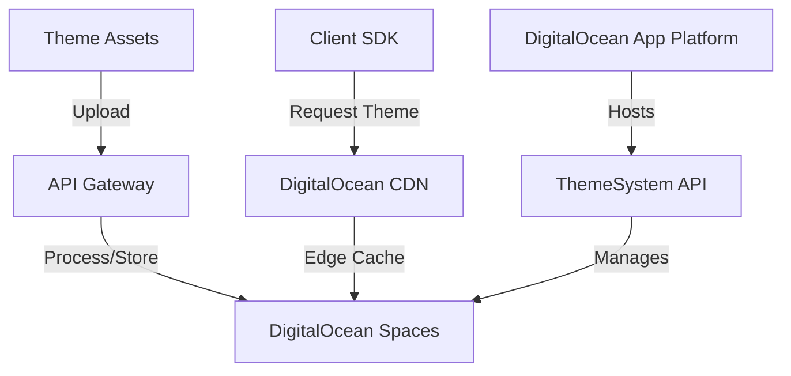
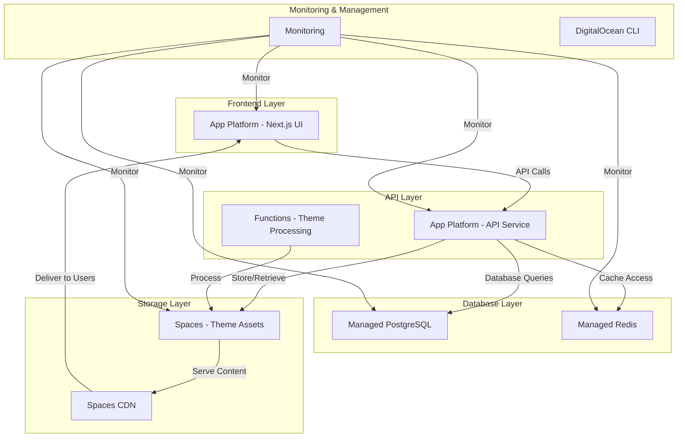

# DigitalOcean Integration for ThemeSystem Platform

## Overview

This document outlines how to integrate DigitalOcean services into the ThemeSystem platform, focusing on DigitalOcean Spaces for S3-compatible object storage and leveraging other DigitalOcean offerings to create a comprehensive, managed infrastructure solution.

## DigitalOcean Spaces for Theme Storage

### Why DigitalOcean Spaces

DigitalOcean Spaces offers several advantages for the ThemeSystem platform:

1. **S3 Compatibility**: Full API compatibility with Amazon S3
2. **Simplified Management**: Fully managed service with no server maintenance required
3. **Integrated CDN**: Built-in content delivery network for global asset distribution
4. **Predictable Pricing**: Flat-rate pricing model for both storage and bandwidth
5. **Regional Flexibility**: Multiple region options for data locality compliance
6. **Developer-Friendly**: Simple API and comprehensive documentation
7. **Seamless Integration**: Works natively with the existing DigitalOcean ecosystem

### Architecture with Spaces



## Complete DigitalOcean Infrastructure

### Core Components



## Implementation Guide

### 1. Setting Up DigitalOcean Spaces

#### Create a New Space

1. Log in to the DigitalOcean Control Panel
2. Navigate to "Spaces" in the left sidebar
3. Click "Create Space"
4. Choose a datacenter region (select the region closest to your users)
5. Name your Space (e.g., `themesystem-assets`)
6. Choose access settings (Restrict File Listing recommended)
7. Click "Create Space"

#### Generate Access Keys

1. In the Spaces section, click "Manage Keys"
2. Click "Generate New Key"
3. Enter a name for your key (e.g., "ThemeSystem-API")
4. Copy and securely store both the Access Key and Secret Key

#### Configure CDN for Your Space

1. Navigate to your newly created Space
2. Click the "Settings" tab
3. Toggle "Enable CDN" to ON
4. Note the CDN endpoint URL (e.g., `https://themesystem-assets.nyc3.cdn.digitaloceanspaces.com`)

### 2. Bucket Structure Implementation

Create the following directory structure in your Space for organized theme asset management:

```
themesystem-assets/
├── themes-published/    # Production-ready themes
├── themes-previews/     # Theme preview images
├── themes-drafts/       # In-development themes
└── themes-documentation/ # Documentation assets
```

You can create these directories via the DigitalOcean console or programmatically:

```javascript
import AWS from "aws-sdk";

// Configure the S3 client for DigitalOcean Spaces
const spacesEndpoint = new AWS.Endpoint("nyc3.digitaloceanspaces.com");
const s3 = new AWS.S3({
  endpoint: spacesEndpoint,
  accessKeyId: process.env.SPACES_KEY,
  secretAccessKey: process.env.SPACES_SECRET,
  region: "nyc3",
});

// Function to create directory structure
async function createDirectoryStructure() {
  const directories = [
    "themes-published/",
    "themes-previews/",
    "themes-drafts/",
    "themes-documentation/",
  ];

  for (const dir of directories) {
    await s3
      .putObject({
        Bucket: "themesystem-assets",
        Key: dir,
        Body: "",
      })
      .promise();

    console.log(`Created directory: ${dir}`);
  }
}

createDirectoryStructure();
```

### 3. Application Integration

#### Backend Integration with Spaces

```javascript
import AWS from "aws-sdk";

// Configure Spaces client
const spacesEndpoint = new AWS.Endpoint(
  process.env.SPACES_ENDPOINT || "nyc3.digitaloceanspaces.com",
);
const s3 = new AWS.S3({
  endpoint: spacesEndpoint,
  accessKeyId: process.env.SPACES_KEY,
  secretAccessKey: process.env.SPACES_SECRET,
  region: process.env.SPACES_REGION || "nyc3",
});

// Store a theme CSS file
async function storeThemeCSS(themeId, version, cssContent) {
  const objectKey = `themes-published/${themeId}/${version}/theme.css`;

  await s3
    .putObject({
      Bucket: "themesystem-assets",
      Key: objectKey,
      Body: cssContent,
      ContentType: "text/css",
      Metadata: {
        "theme-id": themeId,
        version: version,
      },
      ACL: "public-read",
    })
    .promise();

  // Return the CDN URL for the theme
  return `https://themesystem-assets.nyc3.cdn.digitaloceanspaces.com/${objectKey}`;
}

// Retrieve a theme CSS file
async function getThemeCSS(themeId, version = "latest") {
  const objectKey = `themes-published/${themeId}/${version}/theme.css`;

  try {
    const data = await s3
      .getObject({
        Bucket: "themesystem-assets",
        Key: objectKey,
      })
      .promise();

    return {
      content: data.Body.toString("utf-8"),
      metadata: data.Metadata,
      lastModified: data.LastModified,
    };
  } catch (error) {
    console.error(`Error fetching theme CSS for ${themeId}:`, error);
    throw error;
  }
}
```

#### Frontend Integration

```javascript
// In your ThemeProvider component
import { useEffect, useState } from "react";

function ThemeProvider({ children, themeId }) {
  const [themeCSS, setThemeCSS] = useState(null);

  useEffect(() => {
    if (!themeId) return;

    // Directly reference the CDN URL
    const themeCDNUrl = `https://themesystem-assets.nyc3.cdn.digitaloceanspaces.com/themes-published/${themeId}/latest/theme.css`;

    // Dynamically load the theme CSS
    const linkElement = document.createElement("link");
    linkElement.rel = "stylesheet";
    linkElement.href = themeCDNUrl;
    linkElement.id = `theme-${themeId}`;

    // Remove previous theme if exists
    const prevTheme = document.head.querySelector(`link[id^="theme-"]`);
    if (prevTheme) {
      document.head.removeChild(prevTheme);
    }

    // Add new theme
    document.head.appendChild(linkElement);

    return () => {
      // Cleanup on unmount or theme change
      const themeLink = document.head.querySelector(`#theme-${themeId}`);
      if (themeLink) {
        document.head.removeChild(themeLink);
      }
    };
  }, [themeId]);

  return children;
}
```

## Deploying with DigitalOcean App Platform

### Benefits of App Platform

1. **Zero DevOps**: Automatic CI/CD from Git
2. **Managed SSL**: Automatic TLS certificate provisioning and renewal
3. **Horizontal Scaling**: Easy scalability with usage
4. **Built-in Monitoring**: Performance and usage metrics
5. **Global CDN**: Edge caching for static assets
6. **Service Integration**: Native integration with Spaces and databases

### Deploying the ThemeSystem

#### 1. Frontend Application

```yaml
# App Platform spec for frontend
name: themesystem-frontend
services:
  - name: web
    github:
      repo: your-org/themesystem
      branch: main
      deploy_on_push: true
    source_dir: apps/themesystem/packages/theme-system/frontend
    build_command: npm run build
    run_command: npm start
    http_port: 3000
    instance_size_slug: basic-xs
    instance_count: 2
    routes:
      - path: /
    envs:
      - key: NEXT_PUBLIC_API_URL
        value: ${api.HOSTNAME}
      - key: NEXT_PUBLIC_SPACES_CDN_URL
        value: https://themesystem-assets.nyc3.cdn.digitaloceanspaces.com
      - key: NODE_ENV
        value: production
```

#### 2. API Service

```yaml
# App Platform spec for API
name: themesystem-api
services:
  - name: api
    github:
      repo: your-org/themesystem
      branch: main
      deploy_on_push: true
    source_dir: apps/themesystem/packages/theme-system/api
    build_command: npm run build
    run_command: npm start
    http_port: 8080
    instance_size_slug: basic-s
    instance_count: 2
    routes:
      - path: /api
    envs:
      - key: SPACES_KEY
        type: SECRET
      - key: SPACES_SECRET
        type: SECRET
      - key: SPACES_ENDPOINT
        value: nyc3.digitaloceanspaces.com
      - key: SPACES_BUCKET
        value: themesystem-assets
      - key: DATABASE_URL
        value: ${db.DATABASE_URL}
      - key: REDIS_URL
        value: ${redis.DATABASE_URL}
```

#### 3. Database Configuration

```yaml
# Database configuration
databases:
  - engine: PG
    name: themesystem-db
    production: true
    cluster_name: themesystem-pg-cluster
    db_name: themesystem
    db_user: themesystem_user

  - engine: REDIS
    name: themesystem-cache
    production: true
    version: "6"
```

## Setting Up Managed PostgreSQL

### Database Schema for ThemeSystem

```sql
-- Create themes table
CREATE TABLE themes (
  id UUID PRIMARY KEY DEFAULT gen_random_uuid(),
  name VARCHAR(100) NOT NULL,
  description TEXT,
  author VARCHAR(100),
  author_url VARCHAR(255),
  version VARCHAR(20) NOT NULL,
  created_at TIMESTAMP WITH TIME ZONE DEFAULT NOW(),
  updated_at TIMESTAMP WITH TIME ZONE DEFAULT NOW(),
  published BOOLEAN DEFAULT FALSE,
  downloads INTEGER DEFAULT 0,
  tags VARCHAR(50)[] DEFAULT '{}',
  preview_url TEXT,
  css_url TEXT NOT NULL
);

-- Create theme_versions table for versioning
CREATE TABLE theme_versions (
  id UUID PRIMARY KEY DEFAULT gen_random_uuid(),
  theme_id UUID NOT NULL REFERENCES themes(id),
  version VARCHAR(20) NOT NULL,
  changes TEXT,
  css_url TEXT NOT NULL,
  created_at TIMESTAMP WITH TIME ZONE DEFAULT NOW(),
  UNIQUE(theme_id, version)
);

-- Create users table
CREATE TABLE users (
  id UUID PRIMARY KEY DEFAULT gen_random_uuid(),
  email VARCHAR(255) UNIQUE NOT NULL,
  name VARCHAR(100),
  role VARCHAR(20) DEFAULT 'user',
  created_at TIMESTAMP WITH TIME ZONE DEFAULT NOW(),
  last_login TIMESTAMP WITH TIME ZONE
);

-- Create user_themes for tracking favorites/installs
CREATE TABLE user_themes (
  user_id UUID REFERENCES users(id),
  theme_id UUID REFERENCES themes(id),
  relationship VARCHAR(20) NOT NULL, -- 'favorite', 'installed', 'created'
  created_at TIMESTAMP WITH TIME ZONE DEFAULT NOW(),
  PRIMARY KEY (user_id, theme_id, relationship)
);

-- Create theme_analytics for usage tracking
CREATE TABLE theme_analytics (
  id BIGSERIAL PRIMARY KEY,
  theme_id UUID REFERENCES themes(id),
  event_type VARCHAR(50) NOT NULL, -- 'view', 'download', 'install'
  occurred_at TIMESTAMP WITH TIME ZONE DEFAULT NOW(),
  user_id UUID REFERENCES users(id),
  client_info JSONB
);

-- Indexes for performance
CREATE INDEX idx_themes_tags ON themes USING GIN(tags);
CREATE INDEX idx_theme_analytics_theme_id ON theme_analytics(theme_id);
CREATE INDEX idx_theme_analytics_occurred_at ON theme_analytics(occurred_at);
```

### Database Connection from App Platform

```javascript
import { Pool } from "pg";

// Connection string is automatically injected by App Platform
const pool = new Pool({
  connectionString: process.env.DATABASE_URL,
  ssl: {
    rejectUnauthorized: false, // Required for DigitalOcean managed databases
  },
});

// Example query function
async function getThemeById(themeId) {
  const query = `
    SELECT t.*, array_agg(DISTINCT tv.version) as available_versions
    FROM themes t
    LEFT JOIN theme_versions tv ON t.id = tv.theme_id
    WHERE t.id = $1
    GROUP BY t.id
  `;

  const result = await pool.query(query, [themeId]);
  return result.rows[0];
}
```

## Setting Up Managed Redis for Caching

```javascript
import { createClient } from "redis";

// Redis client setup
const redisClient = createClient({
  url: process.env.REDIS_URL,
  socket: {
    tls: true,
    rejectUnauthorized: false, // Required for DigitalOcean managed Redis
  },
});

redisClient.on("error", (err) => console.log("Redis Client Error", err));

await redisClient.connect();

// Cache theme data
async function cacheThemeData(themeId, themeData, ttl = 3600) {
  const key = `theme:${themeId}`;
  await redisClient.set(key, JSON.stringify(themeData), {
    EX: ttl, // Expire in seconds
  });
}

// Get cached theme data
async function getCachedThemeData(themeId) {
  const key = `theme:${themeId}`;
  const cachedData = await redisClient.get(key);

  if (!cachedData) return null;

  try {
    return JSON.parse(cachedData);
  } catch (error) {
    console.error("Error parsing cached theme data:", error);
    return null;
  }
}

// Cache theme popularity rankings
async function updateThemePopularity(themeId, increment = 1) {
  await redisClient.zIncrBy("popular:themes", increment, themeId);
}

// Get popular themes
async function getPopularThemes(limit = 10) {
  return await redisClient.zRange("popular:themes", 0, limit - 1, {
    REV: true, // Reverse order (highest score first)
  });
}
```

## Monitoring and Observability

### DigitalOcean Monitoring Integration

```javascript
// Example of adding custom metrics
import axios from "axios";

// Function to send custom metrics to DO Monitoring
async function recordMetric(metricName, value, tags = {}) {
  // Get the monitoring API token from environment variables
  const token = process.env.DO_MONITORING_TOKEN;

  // Prepare the metric data
  const metricData = {
    type: "custom",
    name: metricName,
    value: value,
    timestamp: new Date().toISOString(),
    tags: {
      service: "themesystem",
      environment: process.env.NODE_ENV,
      ...tags,
    },
  };

  // Send the metric to DigitalOcean Monitoring API
  try {
    await axios.post(
      "https://api.digitalocean.com/v2/monitoring/metrics",
      metricData,
      {
        headers: {
          Authorization: `Bearer ${token}`,
          "Content-Type": "application/json",
        },
      },
    );
  } catch (error) {
    console.error("Error sending metric to DigitalOcean:", error);
  }
}

// Example usage
async function recordThemeLoaded(themeId) {
  await recordMetric("theme.loaded", 1, { theme_id: themeId });
}
```

### Creating Alert Policies

```javascript
// Example alert policy creation using the DO API
import axios from "axios";

async function createAlertPolicy() {
  const token = process.env.DO_API_TOKEN;

  const policyData = {
    name: "High Theme Error Rate",
    description: "Alert when theme loading errors exceed threshold",
    type: "v1/insights/droplet/load_1",
    enabled: true,
    tags: ["themesystem", "production"],
    alerts: {
      email: ["alerts@themesystem.com"],
      slack: {
        url: "https://hooks.slack.com/services/...",
        channel: "#alerts",
      },
    },
    compare: "GreaterThan",
    value: 5,
    window: "5m",
    entities: ["all"],
  };

  try {
    const response = await axios.post(
      "https://api.digitalocean.com/v2/monitoring/alerts",
      policyData,
      {
        headers: {
          Authorization: `Bearer ${token}`,
          "Content-Type": "application/json",
        },
      },
    );

    console.log("Alert policy created:", response.data);
  } catch (error) {
    console.error("Error creating alert policy:", error);
  }
}
```

## Cost Analysis: DigitalOcean vs. AWS

### Infrastructure Cost Comparison (Monthly)

| Component                         | DigitalOcean | AWS Equivalent                    |
| --------------------------------- | ------------ | --------------------------------- |
| **App Platform (2 Basic nodes)**  | $24          | Elastic Beanstalk: $30-40         |
| **Managed PostgreSQL (1GB)**      | $15          | RDS (1GB): $30-35                 |
| **Managed Redis (1GB)**           | $15          | ElastiCache (1GB): $25-30         |
| **Spaces (250GB + 1TB transfer)** | $5           | S3 (250GB + 1TB transfer): $10-15 |
| **CDN (1TB)**                     | Included     | CloudFront (1TB): $85-100         |
| **Load Balancer**                 | Included     | ELB: $18-25                       |
| **SSL Certificates**              | Included     | ACM: Free but requires management |
| **Monitoring**                    | Included     | CloudWatch: $10-15                |
| **Total**                         | **$59**      | **$208-260**                      |

### Spaces vs. S3 Pricing

| Storage/Bandwidth            | DigitalOcean Spaces | AWS S3               |
| ---------------------------- | ------------------- | -------------------- |
| 250GB Storage                | $5 flat rate        | $5.75 ($0.023/GB)    |
| 1TB Bandwidth                | Included            | $90 ($0.09/GB)       |
| 5TB Storage + 5TB Transfer   | $25                 | $115 + $450 = $565   |
| 10TB Storage + 10TB Transfer | $50                 | $230 + $900 = $1,130 |

### Pricing Benefits

1. **Predictable Costs**: DigitalOcean's flat-rate pricing makes budgeting more predictable
2. **Included Bandwidth**: Significantly reduces costs for high-traffic applications
3. **Bundled Services**: Many features (CDN, SSL, monitoring) included at no extra cost
4. **No Hidden Fees**: Fewer additional charges compared to AWS
5. **Simpler Pricing Model**: Easier to calculate and forecast expenses

## Security Implementation

### 1. Access Management

```javascript
// Example of creating restricted access tokens for Spaces
import { generateSpacesToken } from "@digitalocean/spaces-token-generator";

// Generate a temporary, scoped access token
function generateTemporaryUploadToken(themeId, userId, expirySeconds = 3600) {
  const policy = {
    expiration: new Date(Date.now() + expirySeconds * 1000).toISOString(),
    conditions: [
      { bucket: "themesystem-assets" },
      { key: `themes-drafts/${themeId}/${userId}/` },
      { "content-type": "text/css" },
      ["content-length-range", 0, 5242880], // Max 5MB
    ],
  };

  return generateSpacesToken(
    process.env.SPACES_KEY,
    process.env.SPACES_SECRET,
    policy,
  );
}
```

### 2. Content Security Policies

```javascript
// In your Next.js API routes or Express middleware
export default function securityHeaders(req, res, next) {
  // Define CSP for allowing theme CSS from Spaces
  res.setHeader(
    "Content-Security-Policy",
    `default-src 'self'; 
     style-src 'self' 'unsafe-inline' https://themesystem-assets.nyc3.cdn.digitaloceanspaces.com; 
     img-src 'self' https://themesystem-assets.nyc3.cdn.digitaloceanspaces.com;
     script-src 'self';
     connect-src 'self' https://api.themesystem.com;`,
  );

  // Add other security headers
  res.setHeader("X-Content-Type-Options", "nosniff");
  res.setHeader("X-Frame-Options", "DENY");
  res.setHeader("X-XSS-Protection", "1; mode=block");

  if (next) next();
}
```

## Deployment and CI/CD Integration

### GitHub Actions Integration

```yaml
# .github/workflows/deploy.yml
name: Deploy to DigitalOcean App Platform

on:
  push:
    branches: [main]

jobs:
  deploy:
    runs-on: ubuntu-latest
    steps:
      - uses: actions/checkout@v3

      - name: Install doctl
        uses: digitalocean/action-doctl@v2
        with:
          token: ${{ secrets.DIGITALOCEAN_ACCESS_TOKEN }}

      - name: Log in to DigitalOcean Container Registry
        run: doctl registry login --expiry-seconds 600

      - name: Build and push API image
        uses: docker/build-push-action@v2
        with:
          context: ./api
          push: true
          tags: registry.digitalocean.com/themesystem/api:${{ github.sha }}

      - name: Update App Platform deployment
        run: |
          doctl apps update ${{ secrets.APP_ID }} --spec .do/app.yaml
          doctl apps create-deployment ${{ secrets.APP_ID }}
```

## Migration Strategy from Existing Infrastructure

### Migration Steps

1. **Data Export and Import**:

   ```bash
   # Export theme assets from existing S3
   aws s3 sync s3://existing-bucket/ ./export/

   # Import to DigitalOcean Spaces
   s3cmd --access_key=SPACES_KEY --secret_key=SPACES_SECRET \
     --host=nyc3.digitaloceanspaces.com --host-bucket=%(bucket)s.nyc3.digitaloceanspaces.com \
     sync ./export/ s3://themesystem-assets/
   ```

2. **Database Migration**:

   ```bash
   # Export PostgreSQL data
   pg_dump -h existing-host -U username -d database > themesystem_dump.sql

   # Import to DigitalOcean Managed PostgreSQL
   psql -h db-postgresql-nyc3-12345-do-user-1234567-0.b.db.ondigitalocean.com \
     -U doadmin -d defaultdb -p 25060 < themesystem_dump.sql
   ```

3. **DNS and Traffic Migration**:

   ```bash
   # Update DNS records to point to DigitalOcean App Platform
   doctl compute domain create themesystem.com --ip-address APP_IP

   # Create required CNAME records
   doctl compute domain records create themesystem.com \
     --record-type CNAME --record-name www --record-data themesystem-ui-12345.ondigitalocean.app.
   ```

## Best Practices and Recommendations

### 1. Performance Optimization

- Leverage DigitalOcean CDN for all static assets
- Implement proper cache control headers for theme assets
- Use Redis caching for frequently accessed theme metadata
- Consider edge functions for theme transformation and customization

### 2. Scalability Planning

- Start with smaller instance sizes and scale up as needed
- Enable auto-scaling in App Platform for handling traffic spikes
- Implement database connection pooling for high-concurrency scenarios
- Use database read replicas for scaling read operations

### 3. Cost Optimization

- Take advantage of the included bandwidth in Spaces pricing
- Choose the appropriate App Platform instance sizes for your needs
- Use lifecycle policies for archiving older theme versions
- Consider reserved databases for long-term cost savings

### 4. Operational Excellence

- Set up comprehensive monitoring and alerting
- Implement proper backup and disaster recovery procedures
- Use infrastructure as code for reproducible deployments
- Document all integration points and dependencies

## Conclusion

DigitalOcean provides a comprehensive, cost-effective, and developer-friendly platform for hosting the ThemeSystem. The combination of App Platform, Spaces, and managed database services creates a complete solution with significantly reduced operational overhead compared to traditional infrastructure or even other cloud providers.

Key advantages include:

1. **Simplified Operations**: Managed services reduce DevOps burden
2. **Cost Efficiency**: Predictable pricing with included bandwidth and features
3. **Performance**: Built-in CDN and global distribution
4. **Developer Experience**: Streamlined deployment and easy scaling
5. **Integrated Ecosystem**: Native connectivity between services

For the ThemeSystem platform, DigitalOcean offers the ideal balance of control, performance, and cost-effectiveness, allowing you to focus on building a great theme marketplace rather than managing infrastructure.

## Appendix: Resource Requirements by Scale

| Scale   | Monthly Active Users | App Platform    | Database | Redis | Spaces Storage | Bandwidth | Est. Monthly Cost |
| ------- | -------------------- | --------------- | -------- | ----- | -------------- | --------- | ----------------- |
| Starter | <5,000               | 2 Basic         | 1GB      | 1GB   | 250GB          | 1TB       | $59               |
| Growth  | 5,000-50,000         | 3 Professional  | 4GB      | 2GB   | 500GB          | 5TB       | $170              |
| Scale   | 50,000-500,000       | 5+ Professional | 8GB+     | 4GB+  | 1TB+           | 10TB+     | $350+             |
