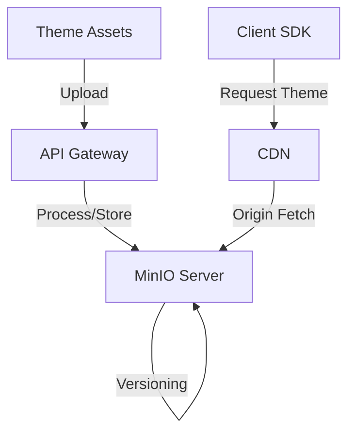
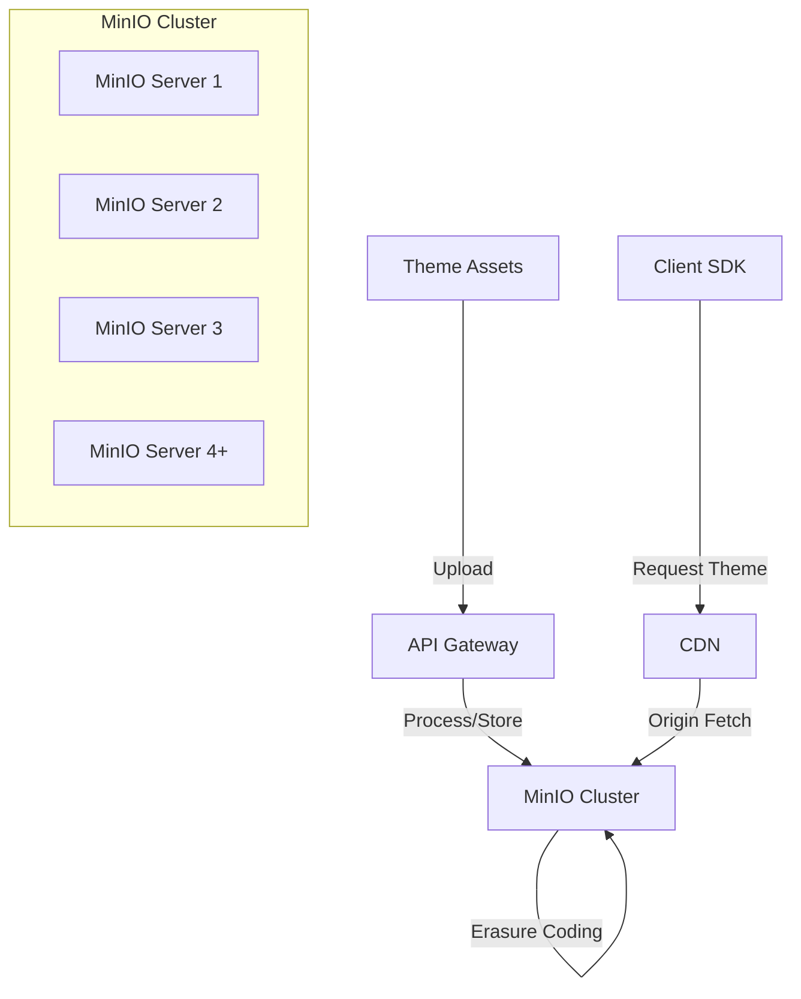
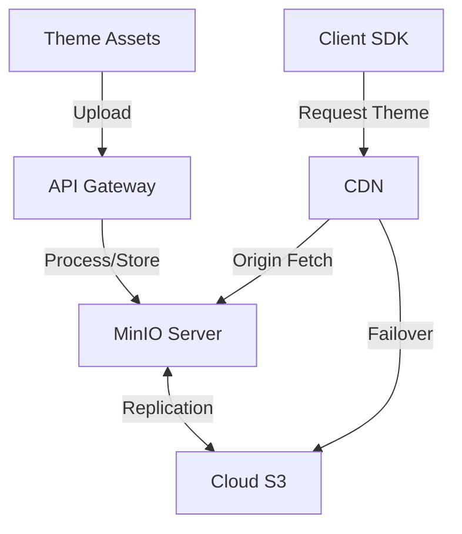

# MinIO Integration for ThemeSystem Platform

## Overview

This document outlines how to integrate [MinIO](https://github.com/minio/minio), an open-source S3-compatible object storage system, into the ThemeSystem platform architecture. MinIO provides a robust, self-hosted alternative to cloud-based S3 services, giving greater control, flexibility, and potentially reduced costs for theme asset storage.

## Why MinIO for ThemeSystem

MinIO offers several advantages as the storage layer for the ThemeSystem platform:

1. **S3 Compatibility**: Full API compatibility with Amazon S3, allowing seamless integration with the existing ThemeSystem architecture
2. **Self-Hosted Option**: Complete control over data storage, compliance, and infrastructure
3. **Performance**: High-throughput object storage optimized for large and small files
4. **Kubernetes Native**: Designed to work natively in container environments
5. **Open Source**: Licensed under GNU AGPLv3, with the option for commercial licensing if needed
6. **Cost-Effective**: Potential for significant cost savings compared to cloud storage for high-volume assets
7. **Multi-tenancy**: Support for isolated tenant storage for enterprise deployments

## Architecture with MinIO

The ThemeSystem platform can utilize MinIO in three deployment models:

### 1. Standalone Deployment



### 2. Distributed Deployment



### 3. Hybrid Cloud Deployment



## Implementation Guide

### Prerequisites

- Linux server or Kubernetes cluster
- Sufficient storage capacity for theme assets
- Network connectivity for CDN and API services

### Installation Options

#### 1. Docker Deployment

```bash
docker run -p 9000:9000 -p 9001:9001 \
  --name minio \
  -v /path/to/theme/data:/data \
  -e "MINIO_ROOT_USER=minioadmin" \
  -e "MINIO_ROOT_PASSWORD=minioadmin" \
  minio/minio server /data --console-address ":9001"
```

#### 2. Kubernetes Deployment

```yaml
apiVersion: apps/v1
kind: Deployment
metadata:
  name: minio
  namespace: themesystem
spec:
  selector:
    matchLabels:
      app: minio
  strategy:
    type: Recreate
  template:
    metadata:
      labels:
        app: minio
    spec:
      containers:
        - name: minio
          image: minio/minio:latest
          args:
            - server
            - /data
            - --console-address
            - ":9001"
          env:
            - name: MINIO_ROOT_USER
              valueFrom:
                secretKeyRef:
                  name: minio-creds
                  key: access_key
            - name: MINIO_ROOT_PASSWORD
              valueFrom:
                secretKeyRef:
                  name: minio-creds
                  key: secret_key
          ports:
            - containerPort: 9000
            - containerPort: 9001
          volumeMounts:
            - name: theme-storage
              mountPath: /data
      volumes:
        - name: theme-storage
          persistentVolumeClaim:
            claimName: theme-storage-pvc
```

#### 3. Binary Installation

For production environments, a bare-metal installation provides the best performance:

```bash
wget https://dl.min.io/server/minio/release/linux-amd64/minio
chmod +x minio
./minio server /path/to/theme/data
```

### Configuration for ThemeSystem

After installation, configure MinIO for optimal ThemeSystem usage:

#### 1. Bucket Structure Setup

Using the MinIO Client (`mc`):

```bash
# Configure MinIO client
mc alias set themesystem http://localhost:9000 minioadmin minioadmin

# Create required buckets
mc mb themesystem/themes-published
mc mb themesystem/themes-previews
mc mb themesystem/themes-drafts
mc mb themesystem/themes-documentation

# Set proper bucket policies
mc policy set download themesystem/themes-published
mc policy set download themesystem/themes-previews
mc policy set download themesystem/themes-documentation
```

#### 2. Versioning Configuration

Enable versioning to maintain theme history:

```bash
mc version enable themesystem/themes-published
```

#### 3. Lifecycle Rules

Configure lifecycle management for older theme versions:

```bash
# Create lifecycle configuration file
cat > lifecycle.json << EOF
{
  "rules": [
    {
      "id": "expire-old-versions",
      "status": "Enabled",
      "filter": {
        "prefix": "v"
      },
      "noncurrentVersionExpiration": {
        "noncurrentDays": 365
      }
    }
  ]
}
EOF

# Apply lifecycle policy
mc ilm import themesystem/themes-published < lifecycle.json
```

#### 4. CORS Configuration

Enable CORS for direct browser access when needed:

```bash
# Create CORS configuration file
cat > cors.json << EOF
{
  "corsRules": [
    {
      "allowedHeaders": ["*"],
      "allowedMethods": ["GET"],
      "allowedOrigins": ["https://themesystem.com", "https://*.themesystem.com"],
      "exposeHeaders": ["ETag"],
      "maxAgeSeconds": 3600
    }
  ]
}
EOF

# Apply CORS configuration
mc admin config set themesystem cors < cors.json
```

## Integration with ThemeSystem Components

### 1. Asset Service Integration

Update the Asset Service to use the MinIO JavaScript SDK:

```javascript
import { Client } from "minio";

// Create MinIO client
const minioClient = new Client({
  endPoint: process.env.MINIO_ENDPOINT || "localhost",
  port: parseInt(process.env.MINIO_PORT || "9000"),
  useSSL: process.env.MINIO_USE_SSL === "true",
  accessKey: process.env.MINIO_ACCESS_KEY,
  secretKey: process.env.MINIO_SECRET_KEY,
});

// Store a theme CSS file
async function storeThemeCSS(themeId, version, cssContent) {
  const objectName = `${themeId}/${version}/theme.css`;
  const metaData = {
    "Content-Type": "text/css",
    "X-Amz-Meta-Theme-ID": themeId,
    "X-Amz-Meta-Version": version,
  };

  await minioClient.putObject(
    "themes-published",
    objectName,
    cssContent,
    metaData,
  );

  return {
    url: `/assets/themes/${themeId}/${version}/theme.css`,
  };
}

// Get a theme CSS file
async function getThemeCSS(themeId, version = "latest") {
  const objectName = `${themeId}/${version}/theme.css`;

  try {
    const dataStream = await minioClient.getObject(
      "themes-published",
      objectName,
    );

    // Process stream and return CSS content
    // ...
  } catch (err) {
    console.error(`Error fetching theme CSS for ${themeId}:`, err);
    throw err;
  }
}
```

### 2. CDN Integration

Configure your CDN to use MinIO as the origin:

#### CloudFront Configuration

```json
{
  "Origins": [
    {
      "Id": "MinIOOrigin",
      "DomainName": "minio.themesystem.com",
      "CustomOriginConfig": {
        "HTTPPort": 80,
        "HTTPSPort": 443,
        "OriginProtocolPolicy": "https-only",
        "OriginSSLProtocols": ["TLSv1.2"]
      }
    }
  ],
  "DefaultCacheBehavior": {
    "TargetOriginId": "MinIOOrigin",
    "ViewerProtocolPolicy": "redirect-to-https",
    "AllowedMethods": ["GET", "HEAD", "OPTIONS"],
    "CachedMethods": ["GET", "HEAD"],
    "ForwardedValues": {
      "QueryString": false,
      "Cookies": {
        "Forward": "none"
      }
    },
    "MinTTL": 0,
    "DefaultTTL": 86400,
    "MaxTTL": 31536000,
    "Compress": true
  }
}
```

#### Cloudflare Worker

```javascript
addEventListener("fetch", (event) => {
  event.respondWith(handleRequest(event.request));
});

async function handleRequest(request) {
  const url = new URL(request.url);

  // Handle theme asset requests
  if (url.pathname.startsWith("/assets/themes/")) {
    // Transform URL to MinIO format
    const minioUrl = new URL(request.url);
    minioUrl.hostname = "minio.themesystem.com";

    // Add cache headers based on asset type
    const response = await fetch(minioUrl, request);
    const modified = new Response(response.body, response);

    if (url.pathname.endsWith(".css")) {
      modified.headers.set("Cache-Control", "public, max-age=604800");
    } else if (url.pathname.match(/\.(png|jpg|webp)$/i)) {
      modified.headers.set("Cache-Control", "public, max-age=2592000");
    }

    return modified;
  }

  // Pass through other requests
  return fetch(request);
}
```

## Security Considerations

### 1. Authentication and Authorization

Secure MinIO access using IAM policies:

```bash
# Create a policy for theme uploaders
cat > theme-creator-policy.json << EOF
{
  "Version": "2012-10-17",
  "Statement": [
    {
      "Effect": "Allow",
      "Action": [
        "s3:PutObject",
        "s3:GetObject"
      ],
      "Resource": [
        "arn:aws:s3:::themes-drafts/*"
      ]
    },
    {
      "Effect": "Allow",
      "Action": [
        "s3:GetObject"
      ],
      "Resource": [
        "arn:aws:s3:::themes-published/*",
        "arn:aws:s3:::themes-previews/*"
      ]
    }
  ]
}
EOF

# Apply the policy
mc admin policy add themesystem theme-creator theme-creator-policy.json

# Create a user with this policy
mc admin user add themesystem theme-creator-user password123
mc admin policy attach themesystem theme-creator theme-creator-user
```

### 2. Encryption

Enable encryption for sensitive theme assets:

```bash
# Enable server-side encryption
mc encrypt set SSE-S3 themesystem/themes-drafts
```

### 3. Network Security

Secure MinIO server with proper network controls:

1. Place MinIO behind a reverse proxy with TLS termination
2. Restrict access using network ACLs
3. Configure firewall rules to allow only necessary connections

## Performance Optimization

### 1. Hardware Recommendations

For production deployments:

| Scale  | RAM      | CPU       | Storage                         |
| ------ | -------- | --------- | ------------------------------- |
| Small  | 8-16 GB  | 4-8 cores | 4+ NVMe SSDs in RAID            |
| Medium | 32-64 GB | 16+ cores | 8+ NVMe SSDs                    |
| Large  | 128+ GB  | 32+ cores | 12+ NVMe SSDs or storage server |

### 2. Erasure Coding

For distributed deployments, enable erasure coding for data protection and availability:

```bash
# Start MinIO with erasure coding (minimum 4 drives)
minio server /path/to/disk{1...4}
```

### 3. Caching Layer

Implement a caching layer for frequently accessed themes:

```javascript
import NodeCache from "node-cache";

const themeCache = new NodeCache({
  stdTTL: 3600, // 1 hour cache
  checkperiod: 120,
});

async function getThemeWithCaching(themeId, version = "latest") {
  const cacheKey = `${themeId}-${version}`;

  // Check cache first
  const cachedTheme = themeCache.get(cacheKey);
  if (cachedTheme) {
    return cachedTheme;
  }

  // Fetch from MinIO if not in cache
  const theme = await getThemeFromMinio(themeId, version);

  // Store in cache
  themeCache.set(cacheKey, theme);

  return theme;
}
```

## Monitoring and Management

### 1. Prometheus Metrics

Enable Prometheus metrics for monitoring:

```bash
# Start MinIO with Prometheus metrics enabled
export MINIO_PROMETHEUS_AUTH_TYPE=public
minio server /path/to/data
```

Sample Prometheus queries:

```
# Total theme storage usage
sum(minio_bucket_usage_object_total{bucket=~"themes.*"})

# Request rates to theme assets
rate(minio_s3_requests_total{bucket="themes-published"}[5m])
```

### 2. Notifications

Configure event notifications for theme updates:

```bash
# Set up webhook notifications for theme uploads
mc event add themesystem/themes-published arn:minio:sqs::1:webhook --event put --suffix .css
```

### 3. Backup Strategy

Implement regular backups:

```bash
# Use rclone for backups
rclone sync minio:themes-published /backup/themes-published
```

## Scalability Considerations

### 1. Horizontal Scaling

For growing theme libraries, implement a distributed MinIO setup:

```bash
# Start a distributed MinIO cluster (minimum 4 servers)
minio server http://minio{1...4}/path/to/data
```

### 2. Tiered Storage

Implement tiered storage for cost-effective archiving of older themes:

```bash
# Configure tiering to glacier storage for old themes
mc ilm tier add themesystem GLACIER glacier-credentials
```

### 3. Global Distribution

For multi-region deployments, implement MinIO site replication:

```bash
# Set up site replication between regions
mc admin replicate add themesystem-us themesystem-eu themesystem-asia
```

## Cost Analysis

### 1. Infrastructure Costs

Comparative cost breakdown between MinIO and cloud S3 (monthly):

| Scale  | Data Volume | MinIO Cost\* | AWS S3 Cost\*\*           |
| ------ | ----------- | ------------ | ------------------------- |
| Small  | 1 TB        | $200-400     | $23 + $90 = $113          |
| Medium | 10 TB       | $600-1,200   | $230 + $900 = $1,130      |
| Large  | 100 TB      | $3,000-6,000 | $2,300 + $9,000 = $11,300 |

\*MinIO costs include server hardware, maintenance, and operations.  
\*\*AWS S3 costs include storage ($0.023/GB) and typical GET requests (100 requests/GB/month).

### 2. Bandwidth Considerations

When serving themes directly (bypassing CDN):

| Scale  | Monthly Bandwidth | MinIO Cost\*\*\* | AWS S3 Cost\*\*\*\* |
| ------ | ----------------- | ---------------- | ------------------- |
| Small  | 5 TB              | $0-250           | $450                |
| Medium | 50 TB             | $0-2,500         | $4,500              |
| Large  | 500 TB            | $0-25,000        | $45,000             |

**\*MinIO bandwidth costs depend on your internet provider.  
\*\***AWS S3 data transfer costs at $0.09/GB.

## Conclusion

Integrating MinIO as the S3-compatible storage layer for the ThemeSystem platform provides a powerful, flexible and potentially cost-effective solution, especially for larger deployments. The self-hosted nature of MinIO gives complete control over theme assets, while maintaining full compatibility with the ThemeSystem architecture and S3 ecosystem.

For smaller deployments or those preferring managed services, cloud-based S3 options might be simpler to maintain. However, as the theme library and usage grow, the cost benefits and control provided by MinIO become increasingly significant.

The choice between MinIO and cloud S3 should be based on:

1. Expected growth of the theme library
2. Technical expertise available for infrastructure management
3. Geographic distribution requirements
4. Regulatory and compliance needs
5. Total cost of ownership considerations

Both options integrate seamlessly with the ThemeSystem architecture, and hybrid approaches are also possible, providing flexibility to adapt as requirements evolve.

## Appendix: MinIO Resource Requirements by Scale

| Asset Count  | Storage Size | MinIO Nodes | RAM per Node | CPU per Node | Network  |
| ------------ | ------------ | ----------- | ------------ | ------------ | -------- |
| <1,000       | <1 TB        | 1           | 8 GB         | 4 cores      | 1 Gbps   |
| 1,000-5,000  | 1-5 TB       | 4           | 16 GB        | 8 cores      | 10 Gbps  |
| 5,000-20,000 | 5-20 TB      | 8           | 32 GB        | 16 cores     | 25 Gbps  |
| >20,000      | >20 TB       | 16+         | 64+ GB       | 32+ cores    | 40+ Gbps |

```

```
