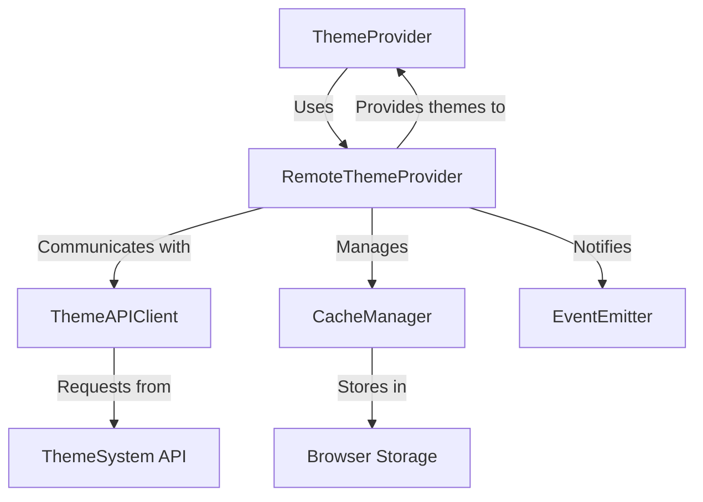

# RemoteThemeProvider Deep Dive

## Overview

The `RemoteThemeProvider` is a core component of the ThemeSystem architecture that enables applications to dynamically fetch, cache, and apply themes from the ThemeSystem.com platform without requiring direct installation of theme packages. This document provides an in-depth explanation of the component's architecture, implementation details, and usage patterns.

## Role in the Architecture

The `RemoteThemeProvider` serves as the bridge between client applications and the remote theme ecosystem:

1. **Theme Discovery**: Fetches available themes from the remote API
2. **Theme Retrieval**: Loads specific themes on demand
3. **Caching Management**: Stores themes locally for improved performance
4. **Offline Support**: Provides fallback mechanisms when network is unavailable
5. **Version Management**: Handles theme updates and compatibility

## Component Architecture

The `RemoteThemeProvider` is designed with a layered architecture to separate concerns and enable flexibility:



### Key Components

#### 1. ThemeAPIClient

Responsible for all direct communication with the ThemeSystem.com API, handling:

- Authentication
- API version compatibility
- Request formatting
- Response parsing
- Error handling

#### 2. CacheManager

Manages the local storage of themes with:

- Multiple storage strategies (localStorage, IndexedDB)
- Cache invalidation policies
- Storage quota management
- Version tracking

#### 3. Event System

Provides notifications for theme-related events:

- Theme loading started/completed
- Cache updates
- Network errors
- Theme availability changes

## Implementation Details

### Core Interfaces

```typescript
interface RemoteThemeConfig {
  /**
   * Whether remote theme functionality is enabled.
   */
  enabled: boolean;

  /**
   * API key for authentication with ThemeSystem.com.
   * Required for premium themes.
   */
  apiKey?: string;

  /**
   * Custom API endpoint URL.
   * Defaults to https://api.themesystem.com/v1
   */
  endpoint?: string;

  /**
   * Filter themes by categories.
   */
  categories?: string[];

  /**
   * Cache storage strategy.
   */
  cacheStrategy?: "memory" | "localStorage" | "indexedDB";

  /**
   * Behavior when offline.
   * 'strict': Only use themes that were explicitly installed
   * 'fallback': Use cached remote themes when offline
   */
  offlineMode?: "strict" | "fallback";

  /**
   * Themes to preload on initialization.
   * Can be an array of theme IDs or true to preload all.
   */
  preload?: string[] | boolean;

  /**
   * Interval in milliseconds to check for theme updates.
   * Set to 0 to disable automatic updates.
   */
  refreshInterval?: number;

  /**
   * Callback when a theme cannot be loaded.
   */
  onThemeLoadError?: (themeId: string, error: Error) => void;
}

interface ThemeMetadata {
  id: string;
  name: string;
  description: string;
  version: string;
  author: string;
  previewUrl: string;
  tags: string[];
  downloads: number;
  rating: number;
  lastUpdated: string;
}

interface ThemeAssets {
  stylesheet: string; // URL or inline CSS
  variables: Record<string, string>;
  customProperties?: Record<string, any>;
}

interface RemoteTheme extends ThemeMetadata, ThemeAssets {
  isRemote: true;
  cached?: boolean;
  fetchedAt?: string;
}
```

### Implementation Class

```typescript
class RemoteThemeProvider {
  private config: RemoteThemeConfig;
  private apiClient: ThemeAPIClient;
  private cache: CacheManager;
  private availableThemes: Map<string, ThemeMetadata> = new Map();
  private loadedThemes: Map<string, RemoteTheme> = new Map();
  private eventEmitter: EventEmitter = new EventEmitter();
  private updateInterval?: number;

  constructor(config: RemoteThemeConfig) {
    this.config = {
      enabled: true,
      endpoint: "https://api.themesystem.com/v1",
      cacheStrategy: "localStorage",
      offlineMode: "fallback",
      refreshInterval: 3600000, // 1 hour
      ...config,
    };

    this.apiClient = new ThemeAPIClient({
      endpoint: this.config.endpoint,
      apiKey: this.config.apiKey,
    });

    this.cache = new CacheManager({
      strategy: this.config.cacheStrategy,
    });

    if (this.config.enabled) {
      this.initialize();
    }
  }

  /**
   * Initialize the provider, fetch available themes
   * and preload themes if configured.
   */
  private async initialize(): Promise<void> {
    try {
      // Restore cached themes
      await this.restoreCache();

      // Fetch available themes if online
      if (navigator.onLine) {
        await this.fetchAvailableThemes();

        // Preload themes if configured
        if (this.config.preload) {
          await this.preloadThemes();
        }
      }

      // Set up refresh interval
      if (this.config.refreshInterval > 0) {
        this.updateInterval = window.setInterval(
          () => this.refreshThemes(),
          this.config.refreshInterval,
        );
      }

      // Listen for online/offline events
      window.addEventListener("online", () => this.handleOnline());
      window.addEventListener("offline", () => this.handleOffline());

      this.eventEmitter.emit("initialized");
    } catch (error) {
      this.eventEmitter.emit("error", error);
    }
  }

  /**
   * Get all available remote themes.
   */
  async getAvailableThemes(): Promise<ThemeMetadata[]> {
    if (!this.config.enabled) {
      return [];
    }

    if (this.availableThemes.size === 0 && navigator.onLine) {
      await this.fetchAvailableThemes();
    }

    return Array.from(this.availableThemes.values());
  }

  /**
   * Get a specific theme by ID.
   */
  async getTheme(themeId: string): Promise<RemoteTheme | null> {
    if (!this.config.enabled) {
      return null;
    }

    // Check if already loaded
    if (this.loadedThemes.has(themeId)) {
      return this.loadedThemes.get(themeId) || null;
    }

    try {
      // Emit loading event
      this.eventEmitter.emit("themeLoading", themeId);

      // Try to load from cache first
      const cachedTheme = await this.cache.getTheme(themeId);
      if (cachedTheme) {
        this.loadedThemes.set(themeId, cachedTheme);
        this.eventEmitter.emit("themeLoaded", themeId, true);

        // Refresh in background if online
        if (navigator.onLine) {
          this.refreshTheme(themeId).catch((e) =>
            console.warn(`Background refresh failed for theme ${themeId}:`, e),
          );
        }

        return cachedTheme;
      }

      // If not in cache and offline, return null
      if (!navigator.onLine) {
        const error = new Error(`Cannot load theme ${themeId} while offline`);
        this.handleThemeLoadError(themeId, error);
        return null;
      }

      // Load from API
      const theme = await this.apiClient.getTheme(themeId);
      if (!theme) {
        const error = new Error(`Theme ${themeId} not found`);
        this.handleThemeLoadError(themeId, error);
        return null;
      }

      // Cache the theme
      await this.cache.setTheme(themeId, theme);

      // Store in memory and emit event
      this.loadedThemes.set(themeId, theme);
      this.eventEmitter.emit("themeLoaded", themeId, false);

      return theme;
    } catch (error) {
      this.handleThemeLoadError(themeId, error as Error);
      return null;
    }
  }

  /**
   * Subscribe to theme-related events.
   */
  on(
    event: "initialized" | "themeLoading" | "themeLoaded" | "error",
    callback: (...args: any[]) => void,
  ): () => void {
    this.eventEmitter.on(event, callback);
    return () => this.eventEmitter.off(event, callback);
  }

  /**
   * Preload specific themes or all available themes.
   */
  async preloadThemes(themeIds?: string[]): Promise<void> {
    if (!this.config.enabled || !navigator.onLine) {
      return;
    }

    try {
      // Determine which themes to preload
      let themesToLoad: string[] = [];

      if (Array.isArray(themeIds)) {
        themesToLoad = themeIds;
      } else if (Array.isArray(this.config.preload)) {
        themesToLoad = this.config.preload;
      } else if (this.config.preload === true) {
        // Preload all available themes
        themesToLoad = Array.from(this.availableThemes.keys());
      }

      // Load themes in parallel with a concurrency limit
      const concurrencyLimit = 3;
      const chunks = this.chunkArray(themesToLoad, concurrencyLimit);

      for (const chunk of chunks) {
        await Promise.all(chunk.map((id) => this.getTheme(id)));
      }
    } catch (error) {
      this.eventEmitter.emit("error", error);
    }
  }

  /**
   * Clear the theme cache.
   */
  async clearCache(): Promise<void> {
    this.loadedThemes.clear();
    await this.cache.clear();
    this.eventEmitter.emit("cacheCleared");
  }

  /**
   * Get the current cache statistics.
   */
  async getCacheStats(): Promise<{
    themeCount: number;
    sizeEstimate: number;
    oldestItem: string;
  }> {
    return this.cache.getStats();
  }

  // Private methods omitted for brevity...
}
```

## Usage Patterns

### Basic Integration

```tsx
import { RemoteThemeProvider, ThemeProvider } from "@acme/theme-system";

function App() {
  return (
    <ThemeProvider
      remote={{
        enabled: true,
        apiKey: "user_api_key",
        preload: ["popular-theme-1", "popular-theme-2"],
        cacheStrategy: "localStorage",
      }}
    >
      <YourApplication />
    </ThemeProvider>
  );
}
```

### Advanced Theme Selection UI

```tsx
import { useEffect, useState } from "react";

import { useTheme } from "@acme/theme-system";

function ThemeSelector() {
  const {
    availableThemes,
    currentTheme,
    setTheme,
    isLoading,
    isRemoteEnabled,
  } = useTheme();

  const [filter, setFilter] = useState("");
  const [filteredThemes, setFilteredThemes] = useState(availableThemes);

  useEffect(() => {
    if (!filter) {
      setFilteredThemes(availableThemes);
      return;
    }

    const lowerFilter = filter.toLowerCase();
    setFilteredThemes(
      availableThemes.filter(
        (theme) =>
          theme.name.toLowerCase().includes(lowerFilter) ||
          theme.description.toLowerCase().includes(lowerFilter) ||
          theme.tags.some((tag) => tag.toLowerCase().includes(lowerFilter)),
      ),
    );
  }, [availableThemes, filter]);

  if (!isRemoteEnabled) {
    return <div>Remote themes are not enabled</div>;
  }

  if (isLoading) {
    return <div>Loading themes...</div>;
  }

  return (
    <div className="theme-selector">
      <input
        type="text"
        placeholder="Search themes..."
        value={filter}
        onChange={(e) => setFilter(e.target.value)}
      />

      <div className="theme-grid">
        {filteredThemes.map((theme) => (
          <div
            key={theme.id}
            className={`theme-card ${theme.id === currentTheme.id ? "active" : ""}`}
            onClick={() => setTheme(theme.id)}
          >
            {theme.isRemote && !theme.cached && (
              <span className="download-indicator">⬇️</span>
            )}
            
            <h3>{theme.name}</h3>
            <div className="theme-meta">
              <span className="author">by {theme.author}</span>
              <span className="downloads">
                {theme.downloads.toLocaleString()} downloads
              </span>
              <span className="rating">★ {theme.rating.toFixed(1)}</span>
            </div>
            <div className="theme-tags">
              {theme.tags.map((tag) => (
                <span key={tag} className="tag">
                  {tag}
                </span>
              ))}
            </div>
          </div>
        ))}
      </div>
    </div>
  );
}
```

### Offline Support Implementation

```typescript
// Extended RemoteThemeProvider methods for offline support

/**
 * Handle the device going offline.
 */
private handleOffline(): void {
  this.eventEmitter.emit('offline');

  // If in strict mode, clear loaded non-cached themes
  if (this.config.offlineMode === 'strict') {
    for (const [id, theme] of this.loadedThemes.entries()) {
      if (!theme.cached) {
        this.loadedThemes.delete(id);
      }
    }
  }
}

/**
 * Handle the device coming back online.
 */
private async handleOnline(): Promise<void> {
  this.eventEmitter.emit('online');

  try {
    // Refresh available themes
    await this.fetchAvailableThemes();

    // Refresh all loaded themes
    const refreshPromises = Array.from(this.loadedThemes.keys())
      .map(id => this.refreshTheme(id));

    await Promise.allSettled(refreshPromises);
  } catch (error) {
    this.eventEmitter.emit('error', error);
  }
}

/**
 * Refresh a specific theme from the API.
 */
private async refreshTheme(themeId: string): Promise<boolean> {
  try {
    const currentTheme = this.loadedThemes.get(themeId);
    if (!currentTheme) return false;

    // Get latest theme version from API
    const latestTheme = await this.apiClient.getTheme(themeId);
    if (!latestTheme) return false;

    // Check if theme has been updated
    if (latestTheme.version !== currentTheme.version) {
      // Update cache
      await this.cache.setTheme(themeId, latestTheme);

      // Update loaded theme
      this.loadedThemes.set(themeId, latestTheme);

      this.eventEmitter.emit('themeUpdated', themeId, latestTheme);
      return true;
    }

    return false;
  } catch (error) {
    console.warn(`Failed to refresh theme ${themeId}:`, error);
    return false;
  }
}
```

## Advanced Features

### 1. Theme Customization Support

The `RemoteThemeProvider` can support theme customization by allowing users to override theme variables:

```typescript
interface ThemeCustomization {
  themeId: string;
  variables: Record<string, string>;
  name?: string; // Custom name for the customized theme
}

// Add to RemoteThemeProvider
async customizeTheme(customization: ThemeCustomization): Promise<string> {
  const baseTheme = await this.getTheme(customization.themeId);
  if (!baseTheme) {
    throw new Error(`Base theme ${customization.themeId} not found`);
  }

  // Create a derived theme ID
  const customThemeId = `${customization.themeId}-custom-${Date.now()}`;

  // Create a new theme with customizations
  const customTheme: RemoteTheme = {
    ...baseTheme,
    id: customThemeId,
    name: customization.name || `Custom ${baseTheme.name}`,
    variables: {
      ...baseTheme.variables,
      ...customization.variables
    },
    isCustomized: true,
    baseThemeId: customization.themeId
  };

  // Store in cache
  await this.cache.setTheme(customThemeId, customTheme);

  // Add to loaded themes
  this.loadedThemes.set(customThemeId, customTheme);

  // Emit event
  this.eventEmitter.emit('themeCustomized', customThemeId, customTheme);

  return customThemeId;
}
```

### 2. A/B Testing Themes

The `RemoteThemeProvider` can facilitate A/B testing of themes:

```typescript
interface ABTestConfig {
  variants: string[]; // Theme IDs to test
  userSegmentation?: (userId: string) => number; // Custom segmentation
  trackingCallback?: (selectedTheme: string) => void; // Analytics
}

// Add to RemoteThemeProvider
initializeABTest(config: ABTestConfig): string {
  // Generate a consistent user identifier
  const userId = this.getUserId();

  // Determine which variant to show
  let variantIndex: number;

  if (config.userSegmentation) {
    // Use custom segmentation
    variantIndex = config.userSegmentation(userId);
  } else {
    // Simple hash-based segmentation
    variantIndex = this.hashString(userId) % config.variants.length;
  }

  // Get the selected theme ID
  const selectedTheme = config.variants[variantIndex];

  // Track the selection
  if (config.trackingCallback) {
    config.trackingCallback(selectedTheme);
  }

  return selectedTheme;
}
```

### 3. Theme Analytics Integration

```typescript
interface AnalyticsConfig {
  enabled: boolean;
  anonymize?: boolean;
  trackEvents?: ('load' | 'switch' | 'error')[];
  customAttributes?: Record<string, string>;
}

// Add to RemoteThemeProvider constructor
if (config.analytics?.enabled) {
  this.initializeAnalytics(config.analytics);
}

// Add to RemoteThemeProvider
private initializeAnalytics(config: AnalyticsConfig): void {
  const trackEvent = (event: string, data: any) => {
    if (!config.trackEvents || config.trackEvents.includes(event as any)) {
      this.apiClient.trackEvent(event, {
        ...data,
        ...(config.customAttributes || {}),
        anonymized: config.anonymize
      });
    }
  };

  // Track theme loading
  this.on('themeLoaded', (themeId, fromCache) => {
    trackEvent('load', { themeId, fromCache });
  });

  // Track theme switching
  this.eventEmitter.on('themeChanged', (prevThemeId, newThemeId) => {
    trackEvent('switch', { prevThemeId, newThemeId });
  });

  // Track errors
  this.on('error', (error) => {
    trackEvent('error', { message: error.message });
  });
}
```

## Performance Considerations

### 1. Lazy Loading

For applications with many potential themes, the `RemoteThemeProvider` implements lazy loading to minimize initial load time:

- Only metadata for available themes is fetched initially
- Theme assets (CSS, variables) are loaded on demand
- Preloading is configurable for common themes

### 2. Caching Strategy

Sophisticated caching reduces network usage and improves performance:

- Themes are cached in browser storage (localStorage or IndexedDB)
- Cached themes are used immediately, then refreshed in the background
- Cache expiration policies prevent stale themes
- Cache size limits prevent excessive storage usage

### 3. Bundle Size Optimization

The `RemoteThemeProvider` is designed to minimize impact on application bundle size:

- Core functionality has minimal dependencies
- Advanced features are tree-shakable
- Browser storage adapters are loaded dynamically

## Security Considerations

### 1. CSS Sanitization

Remote themes could potentially contain malicious CSS, so the provider:

- Validates theme CSS before application
- Restricts CSS to appropriate selectors
- Sandboxes theme application when possible
- Provides CSP recommendations

### 2. API Security

Communication with the ThemeSystem API employs security best practices:

- HTTPS-only communication
- API key validation
- CORS enforcement
- Rate limiting awareness

## Edge Cases and Error Handling

### 1. Network Failures

The `RemoteThemeProvider` handles network issues gracefully:

```typescript
private async fetchAvailableThemes(): Promise<void> {
  try {
    const themes = await this.apiClient.getAvailableThemes({
      categories: this.config.categories
    });

    // Update the available themes map
    this.availableThemes.clear();
    themes.forEach(theme => {
      this.availableThemes.set(theme.id, theme);
    });

    this.eventEmitter.emit('themesAvailable', themes);
  } catch (error) {
    // Fall back to cached theme list
    const cachedThemeList = await this.cache.getThemeList();
    if (cachedThemeList.length > 0) {
      cachedThemeList.forEach(theme => {
        this.availableThemes.set(theme.id, theme);
      });
      this.eventEmitter.emit('themesAvailable', cachedThemeList);
    }

    // Re-throw for higher-level handling
    throw error;
  }
}
```

### 2. Storage Quota Exceeded

```typescript
private async handleStorageQuotaError(themeId: string): Promise<boolean> {
  try {
    // Get cache stats
    const stats = await this.cache.getStats();

    // If we have cached themes, try to make room
    if (stats.themeCount > 0) {
      // Get least recently used themes
      const lruThemes = await this.cache.getLRUThemes(3);

      // Remove them from cache
      for (const oldThemeId of lruThemes) {
        await this.cache.removeTheme(oldThemeId);

        // Also remove from loaded themes if not the current theme
        if (oldThemeId !== this.currentThemeId) {
          this.loadedThemes.delete(oldThemeId);
        }
      }

      // Try again to cache the theme
      return true;
    }

    return false;
  } catch (error) {
    console.error('Failed to handle storage quota error:', error);
    return false;
  }
}
```

### 3. Fallback Mechanism

```typescript
private getFallbackTheme(): RemoteTheme {
  // Create a minimal fallback theme
  return {
    id: 'fallback-theme',
    name: 'Fallback Theme',
    description: 'Basic theme used when no other theme is available',
    version: '1.0.0',
    author: 'ThemeSystem',
    previewUrl: '',
    stylesheet: `:root { --background-color: #ffffff; --text-color: #000000; }`,
    variables: {
      '--background-color': '#ffffff',
      '--text-color': '#000000'
    },
    tags: ['fallback'],
    downloads: 0,
    rating: 0,
    lastUpdated: new Date().toISOString(),
    isRemote: true,
    isFallback: true
  };
}
```

## Conclusion

The `RemoteThemeProvider` component is a sophisticated piece of the ThemeSystem architecture that enables the dynamic, resilient, and performant delivery of themes from the ThemeSystem.com platform to client applications. Its design balances multiple concerns:

- **Performance**: Through intelligent caching and lazy loading
- **Reliability**: With robust offline support and error handling
- **Security**: By validating and sanitizing remote content
- **Flexibility**: Supporting various use cases and integration patterns
- **User Experience**: Providing a seamless theme discovery and switching experience

By leveraging this component, applications can access a growing ecosystem of themes without the overhead of installing and updating multiple theme packages. The `RemoteThemeProvider` is a key enabler of the ThemeSystem platform's vision for a dynamic, centralized theme ecosystem.
