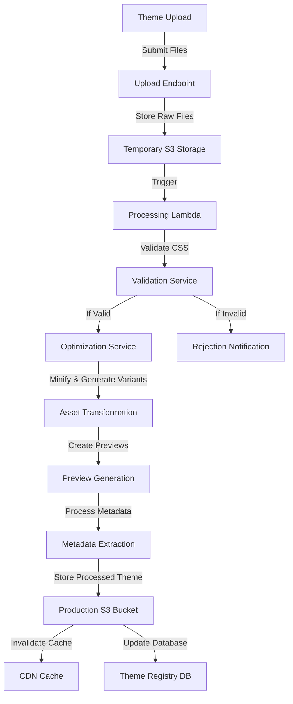

# S3 Storage System Deep Dive

## Overview

The ThemeSystem platform uses S3-compatible object storage as a core component of its architecture, providing a scalable, reliable, and cost-effective solution for storing and distributing theme assets. This document explains the role of S3 storage in the ThemeSystem, its implementation details, and best practices for deployment.

## Role in the Architecture

S3 storage serves as the primary repository for all theme-related assets:

1. **Theme CSS Files**: The actual stylesheet files that define each theme
2. **Preview Images**: Screenshots and thumbnails that showcase themes
3. **Documentation**: Markdown files, guides, and related assets
4. **Component Showcases**: Examples of themes applied to common UI components
5. **Version Archives**: Historical versions of themes for compatibility

## Implementation Details

### Storage Structure

The S3 bucket is organized with a clear hierarchical structure:

```
themes/
├── published/
│   ├── glass-theme/
│   │   ├── v1.0.0/
│   │   │   ├── glass-theme.css
│   │   │   ├── glass-theme.min.css
│   │   │   ├── variables.json
│   │   │   └── metadata.json
│   │   ├── v1.1.0/
│   │   │   └── ...
│   │   └── latest/
│   │       └── ... (symlinks or copies of the latest version)
│   ├── brutalist-theme/
│   │   └── ...
│   └── ...
├── previews/
│   ├── glass-theme/
│   │   ├── thumbnail.png
│   │   ├── full-preview.png
│   │   ├── dark-mode.png
│   │   └── components/
│   │       ├── buttons.png
│   │       ├── cards.png
│   │       └── ...
│   ├── brutalist-theme/
│   │   └── ...
│   └── ...
├── drafts/
│   └── ... (unpublished themes or updates)
└── documentation/
    ├── glass-theme/
    │   ├── README.md
    │   ├── installation.md
    │   └── customization.md
    └── ...
```

### Metadata Storage

Each theme stores essential metadata alongside its assets:

```json
{
  "id": "glass-theme",
  "name": "Glass Theme",
  "description": "Clean, minimal interface with subtle transparency effects",
  "version": "1.2.0",
  "author": "ACME Design",
  "authorUrl": "https://example.com",
  "license": "MIT",
  "created": "2023-04-10T14:30:00Z",
  "updated": "2023-05-15T20:15:30Z",
  "compatibility": {
    "minCoreVersion": "2.0.0",
    "maxCoreVersion": null
  },
  "variables": {
    "--glass-background": "rgba(255, 255, 255, 0.8)",
    "--glass-blur": "8px"
  },
  "tags": ["minimal", "modern", "transparent"],
  "previewImages": {
    "thumbnail": "previews/glass-theme/thumbnail.png",
    "fullPreview": "previews/glass-theme/full-preview.png",
    "components": [
      "previews/glass-theme/components/buttons.png",
      "previews/glass-theme/components/cards.png"
    ]
  }
}
```

## Integration with CDN

The S3 storage is not directly accessed by client applications. Instead, it serves as the origin for a CDN distribution:

1. **S3 Bucket**: Primary storage for theme assets
2. **CDN Layer**: Cloudflare or CloudFront distribution pointing to the S3 bucket
3. **API Gateway**: Routes theme asset requests to the appropriate CDN URLs

This architecture provides:

- Global low-latency access to theme assets
- Reduced load on the origin S3 bucket
- DDoS protection
- SSL termination
- Bandwidth cost optimization

## Theme Upload and Processing Pipeline

When a theme creator uploads a new theme or updates an existing one, the following pipeline processes the assets:



## Security Considerations

The S3 storage implementation includes several security measures:

1. **Private Bucket Access**: S3 buckets are not publicly accessible
2. **IAM Role Restrictions**: Strict permissions for services that access S3
3. **Versioning**: S3 versioning enabled to prevent accidental deletion
4. **Content Validation**: CSS and other assets are validated before storage
5. **CORS Configuration**: Appropriate CORS headers for browser access
6. **Object Locking**: Critical assets protected from modification
7. **Encryption**: Server-side encryption for stored assets

## Best Practices for S3 Implementation

### 1. Performance Optimization

- **Enable Transfer Acceleration**: For faster uploads from theme creators
- **Use S3 Select**: For efficiently retrieving specific metadata
- **Multi-part Uploads**: For larger theme packages
- **Appropriate Storage Class**: Standard for active themes, Infrequent Access for legacy versions

### 2. Cost Optimization

- **Lifecycle Policies**: Automatically transition older theme versions to cheaper storage tiers
- **Intelligent Tiering**: For theme assets with unpredictable access patterns
- **Compression**: Storing compressed assets to reduce storage costs
- **CDN Caching**: Reducing origin requests to S3

### 3. Reliability Enhancement

- **Cross-Region Replication**: For disaster recovery
- **S3 Versioning**: Protecting against accidental deletion
- **Access Logs**: For auditing and troubleshooting
- **S3 Batch Operations**: For bulk processing when needed

## Integration Points

The S3 storage integrates with other ThemeSystem components:

1. **API Service**: Retrieves theme metadata and generates signed URLs when needed
2. **CDN Layer**: Uses S3 as an origin for global distribution
3. **Upload Service**: Places new themes into the S3 structure
4. **Processing Workers**: Transform and validate theme assets before storage
5. **Analytics Service**: Tracks theme downloads and usage patterns

## Scaling Considerations

The S3 storage architecture can scale to support thousands of themes:

1. **Request Rate Scaling**: S3 can handle thousands of requests per second
2. **Storage Scaling**: Effectively unlimited storage capacity
3. **Partitioning Strategy**: Organizing themes by ID prefix for balanced distribution
4. **Read/Write Patterns**: Optimizing for read-heavy workloads (many downloads, few uploads)

## Monitoring and Operations

The S3 component should be monitored for:

1. **Storage Usage**: Total storage consumed and growth rate
2. **Request Patterns**: Popular themes, access spikes
3. **Error Rates**: Failed uploads or downloads
4. **Cost Metrics**: Storage costs, data transfer costs
5. **Latency**: Time to first byte for asset retrieval

## Disaster Recovery

The S3 component includes disaster recovery planning:

1. **Cross-Region Replication**: Automatic copies to alternate regions
2. **Backup Policy**: Regular backups of theme metadata
3. **Restoration Process**: Documented procedures for bucket restoration
4. **Failover Mechanism**: Alternative CDN sources if primary region is unavailable

## Development vs Production Environment

The implementation should differentiate between environments:

1. **Development Bucket**: For testing new features and theme uploads
2. **Staging Bucket**: For pre-production verification
3. **Production Bucket**: For live theme serving
4. **Testing Harness**: Isolated buckets for automated testing

## Conclusion

The S3 storage system is a critical component of the ThemeSystem architecture, providing reliable, scalable, and cost-effective storage for theme assets. By following the implementation details and best practices outlined in this document, the platform can support the storage and distribution needs of a growing theme ecosystem, from dozens to thousands of themes.

By leveraging S3's capabilities in conjunction with CDN distribution, the ThemeSystem platform can deliver theme assets with low latency globally while maintaining high availability and security.
